# Setup locally hosted 360° Videos
[[_TOC_]]

### Installing the Webserver

* Download the addon from [https://static.sapsailing.com/webserver-chrome/web-server-chrome.crx](https://static.sapsailing.com/webserver-chrome/web-server-chrome.crx),   if downloading in chrome it might try to directly install, and give an error that this is not supported, ignore this
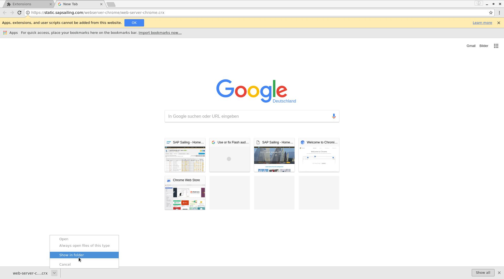
  
* open the extensions page in chrome [chrome://extensions/](chrome://extensions/)
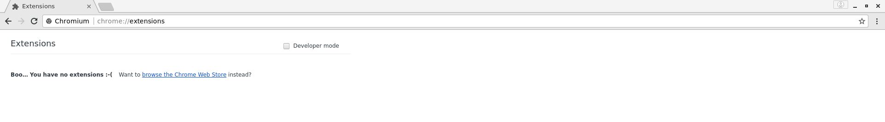
  
* the next step will approximatly need 1 minute, there will be no visible response during that time, this is expected
* Drag the crx file from a file manager over the extensions page. A hover notification similar to "Drop to install" should appear
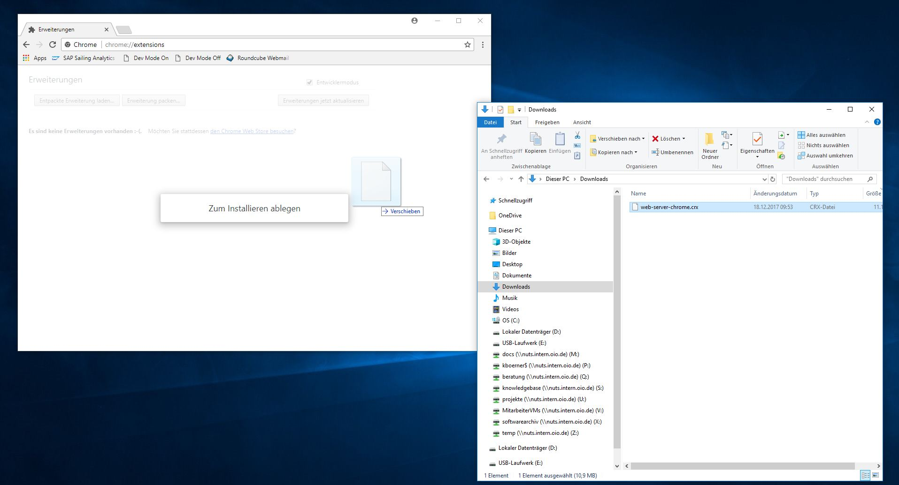
  
* A few moments later, a confirmation dialog should appear, confirm it to install the chrome app
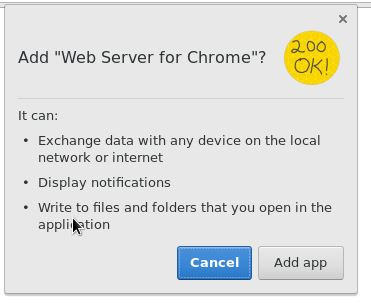

### Using the Webserver
* The webserver can be started from [chrome://apps/](chrome://apps/), it should have a title "Web Server" and a 200 ok logo
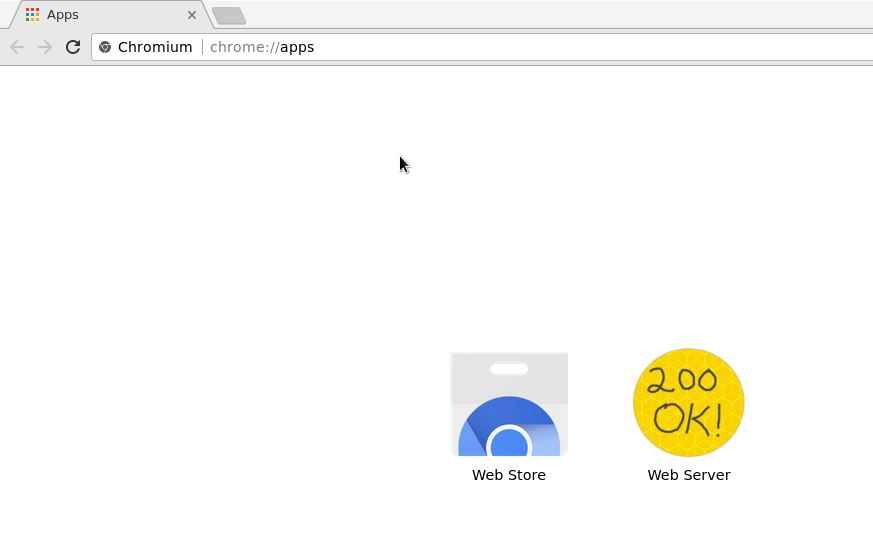
  
* Upon clicking the button, a new Window with the Servers main view should open. Keep this open, as with default configuration the Server will be closed together with the config window
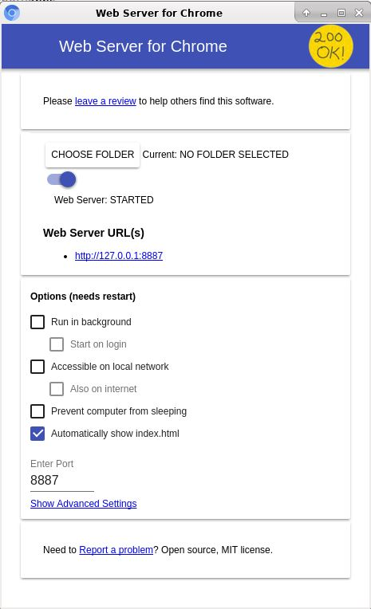
  
* Ensure that under "Show Advanced Settings" the checkbox "Set CORS headers" is enabled
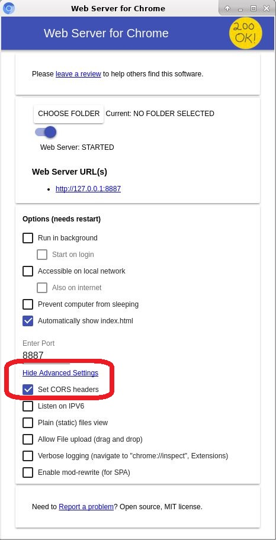
  
* Choose the folder with the videos
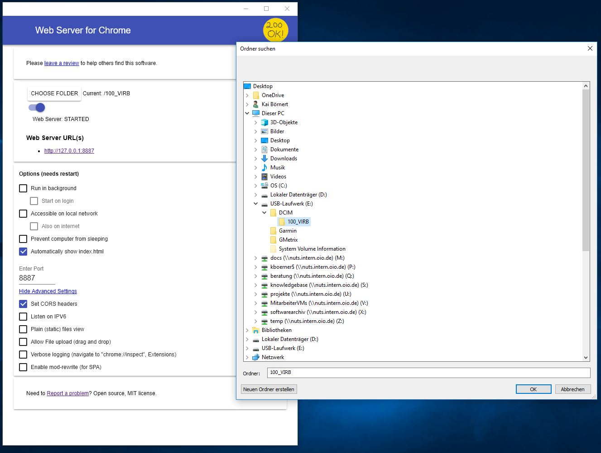
* Under http://127.0.0.1:8887 (default) the files of the folder should be browseable
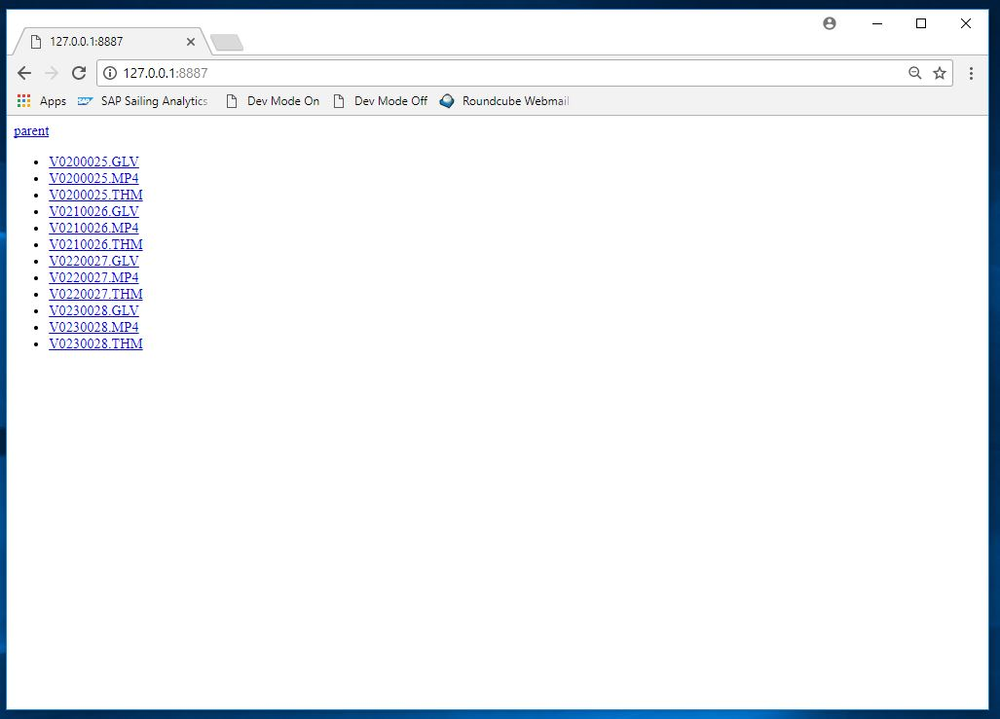

### adding a 360 Video
* After navigating into the RaceBoard
* Click manage Media, if this button does not appear, check that you are signed in (upper right corner)

  
* Click add at the bottom of the newly opened Media Manage dialog
* You should now see the following dialog:

  
* Copy the url of a video from the former part
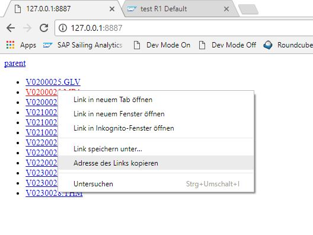
* And paste it into the URL textbox

  
* Delete any trailing data, after the .MP4
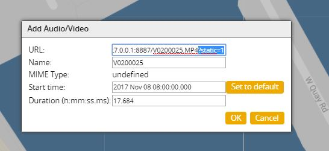
  
* wait for the autodetection (this will most likely fail, as the sapsailing server cannot reach your locally hosted file, this is ok. Dismiss the dialog warning about this)  
1. manually set the MimeType to mp4panorama in case of a 360 video, use mp4 for a normal 2D video from other sources
2. set a proper Starttime. With the Set to default button, the starttime of the race will be selected, please adjust as required.   It is later possible to properly synchronize the video, if a small delay exists, so this does not have to be perfect, the close this is the easier the synchronisazion will be

  
* Close the Dialog with OK, a small video player should appear (it's content might be black, this is ok), if it does not appear please try reloading the page

* Using the edit button and the various +&- increment buttons, the video can be fine synchronized if required, do not forget to click save if adjusted
* Once the timeSlider is within a valid range (determined by the starttime and duration of the video) the player will start and play concurrently with the map.

