# Setup locally hosted 360° Videos
[[_TOC_]]

## Installing the Webserver

* Download the zip from [https://static.sapsailing.com/webserver-nginx/nginx-videohost.zip](https://static.sapsailing.com/webserver-nginx/nginx-videohost.zip).
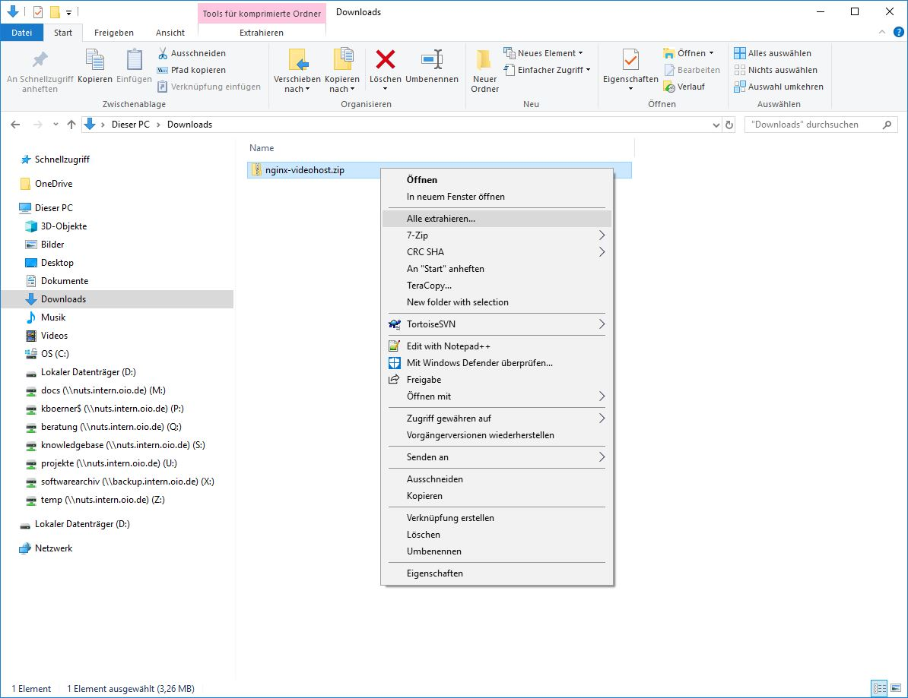
  
* Extract the zip into some easily reachable folder. (eg the Desktop) using the inbuild extractor of your operating system.
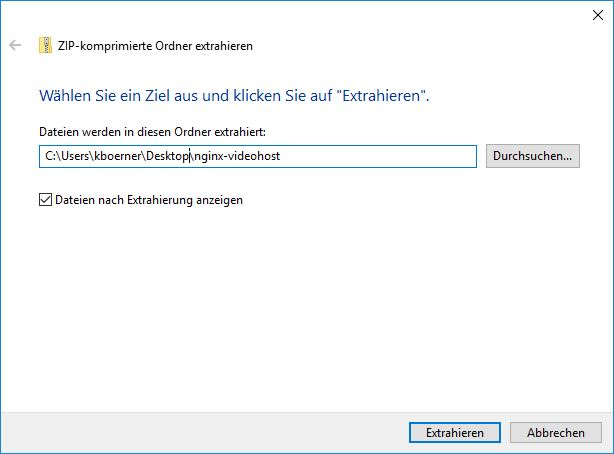
  
* The extracted folder should look like this:
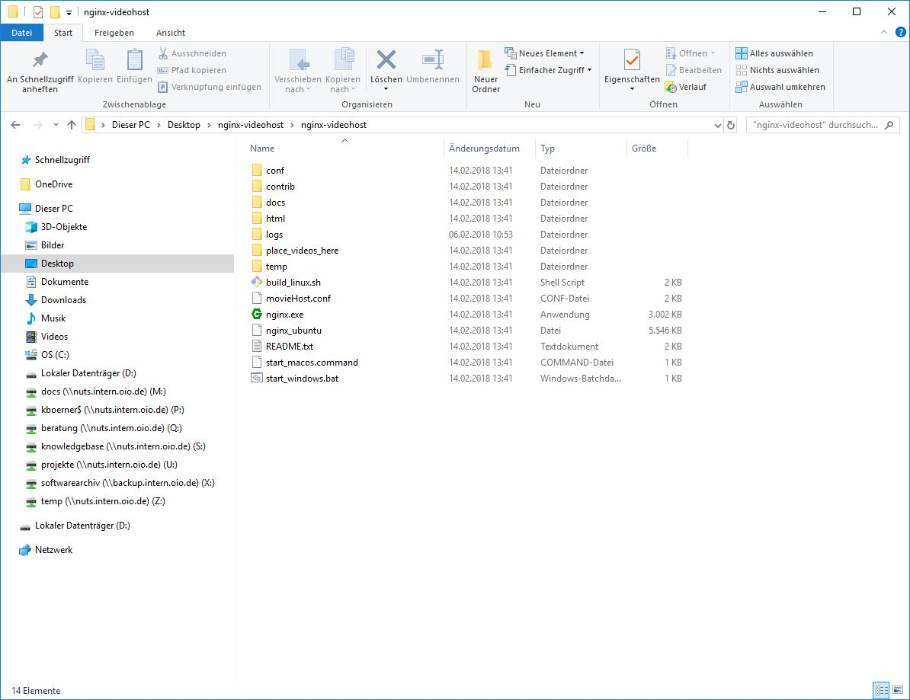

### Windows specific

* If you are running windows, double click the start_windows.bat 
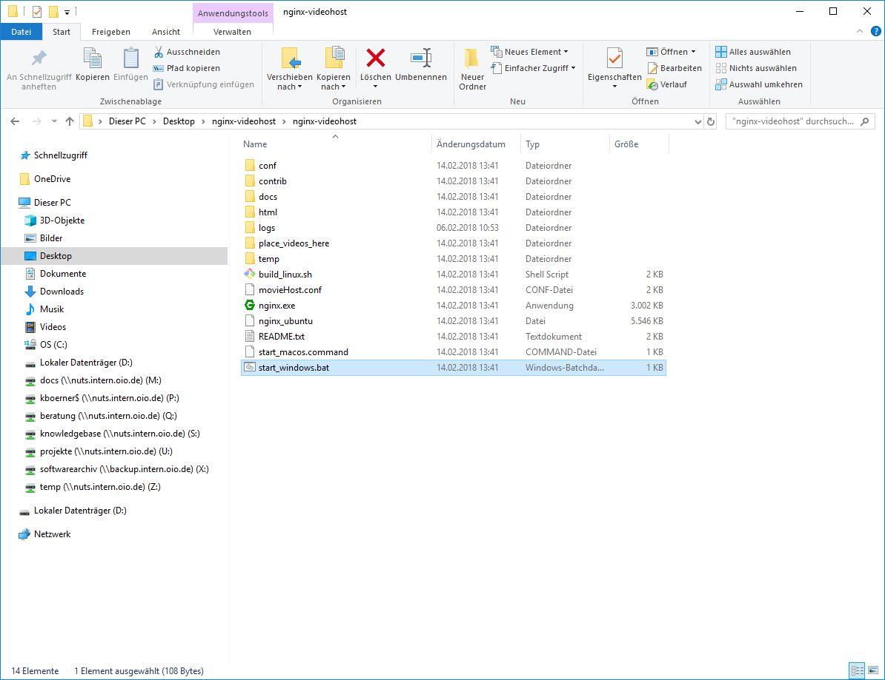
  
* Upon this a security dialog appears, confirm it  
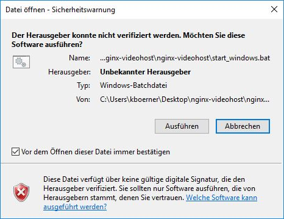
  
* After this a cmd.exe window should open that looks similar to this one 
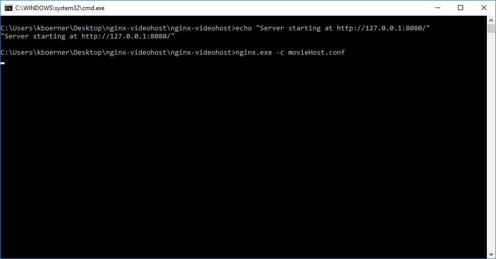
  

### Mac specific

* If you are running MacOSX, execute start_maxos.command
* This script will start nginx with the correct configuration.
* If nginx is not already installed, it will be installed using homebrew
* If homebrew is not installed, it will also be installed prior
* If there are any dialogs requesting to install required software, confirm them.

### Linux specific

If you are on Linux you can: 
* Try to start the supplied 64bit ubuntu static build ./nginx_ubuntu  
* if it crashes/ does not work use your systems packagemanager to download nginx and start it with nginx -c movieHost.conf 
* or use the supplied shell script "build_linux.sh" to download the required sources and compile nginx for your system. 

## Testing the Server

* Browse to [http://127.0.0.1:8080/](http://127.0.0.1:8080/) the following website should appear. If you are on a different computer, replace the ip address with one the server can be reached with.
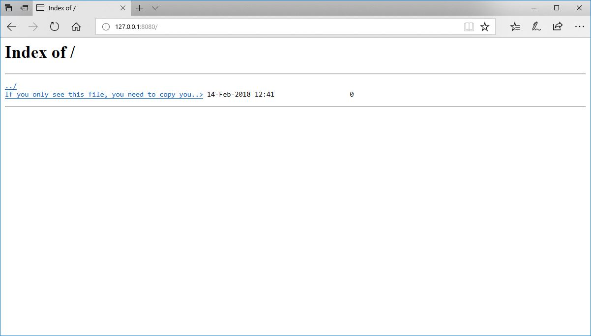
  
* To add new videos go to the folder place\_videos\_here
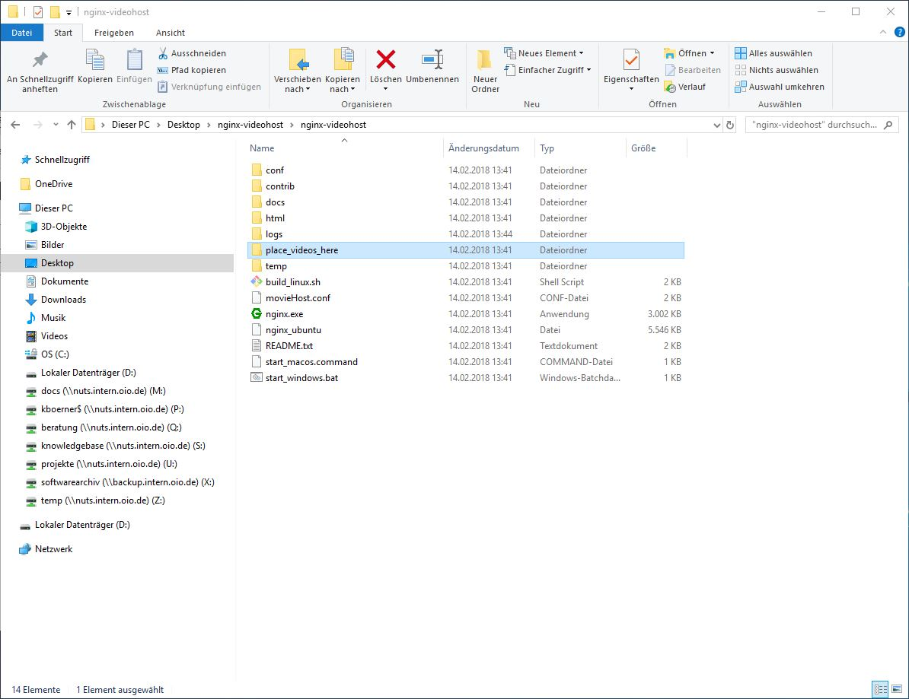
  
* And copy your files into it
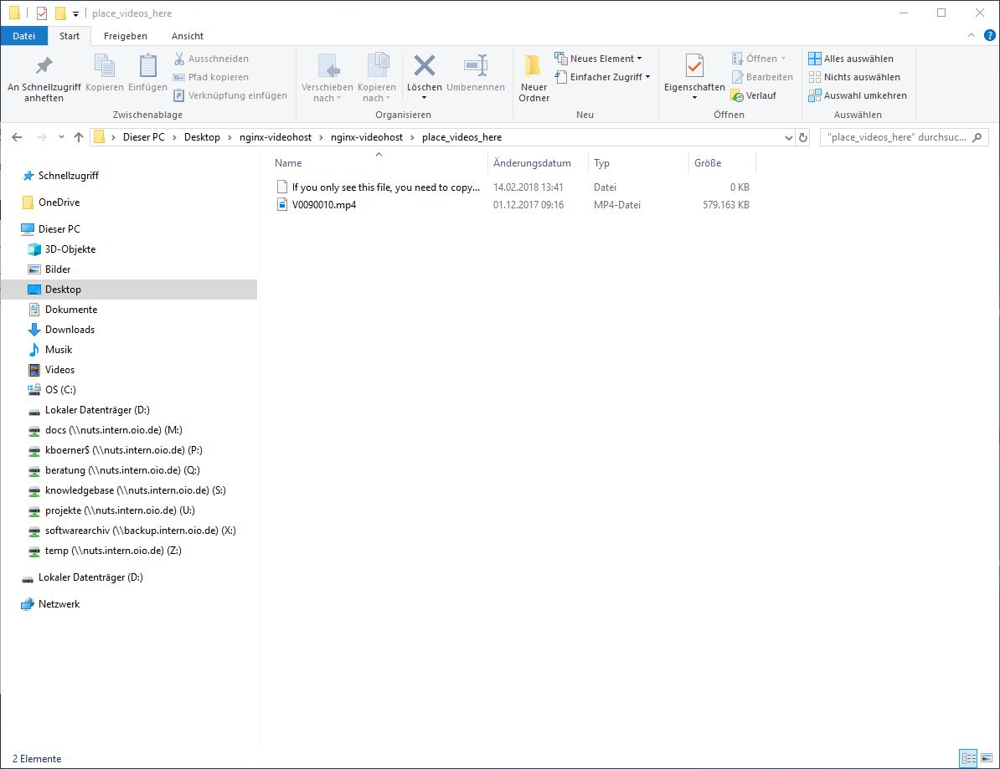
  
* Following a refresh in the browser (F5) the video file should appear in the list:

  
* Click on it to verify it is reachable, note that depending on the browser 360° videos will look distorted.
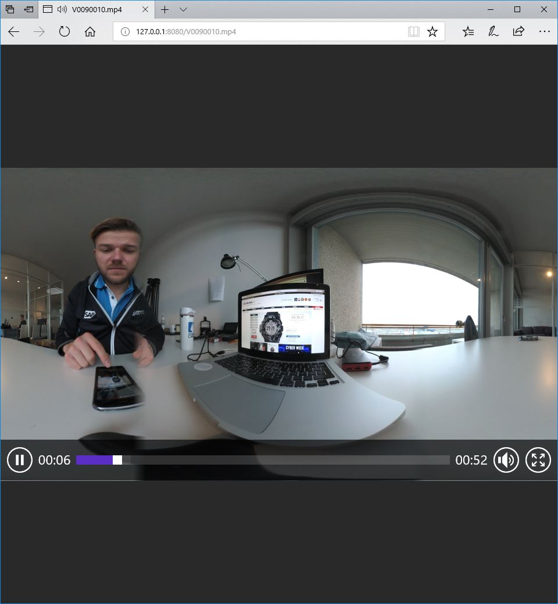
  

## adding a 360 Video

* After navigating into the RaceBoard
* Click manage Media, if this button does not appear, check that you are signed in (upper right corner)
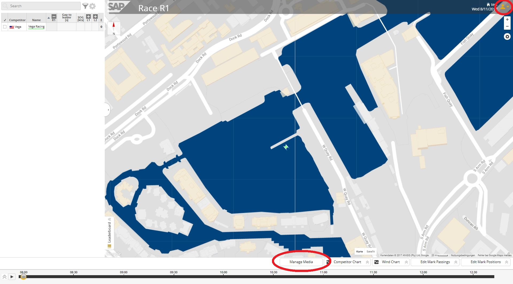
  
* Click add at the bottom of the newly opened Media Manage dialog
* You should now see the following dialog: 
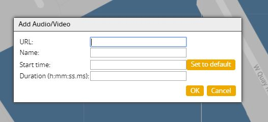
  
* Copy the url of a video from the former part 
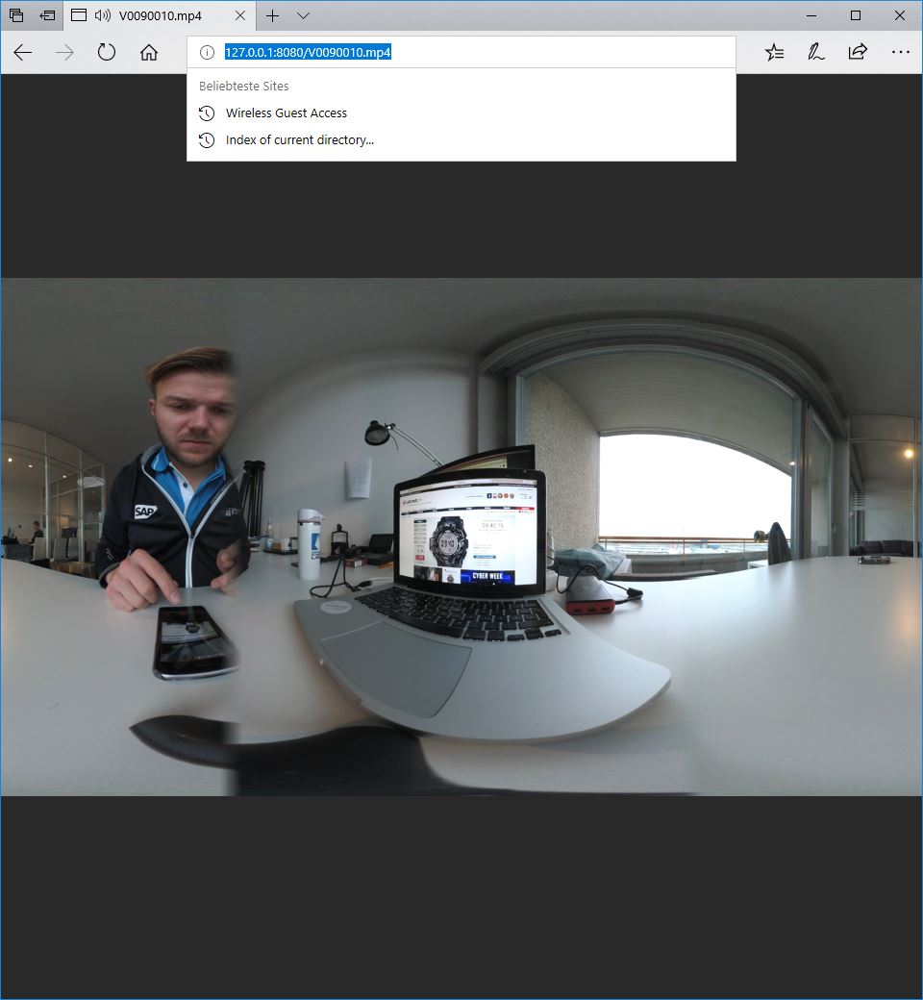
* And paste it into the URL textbox 
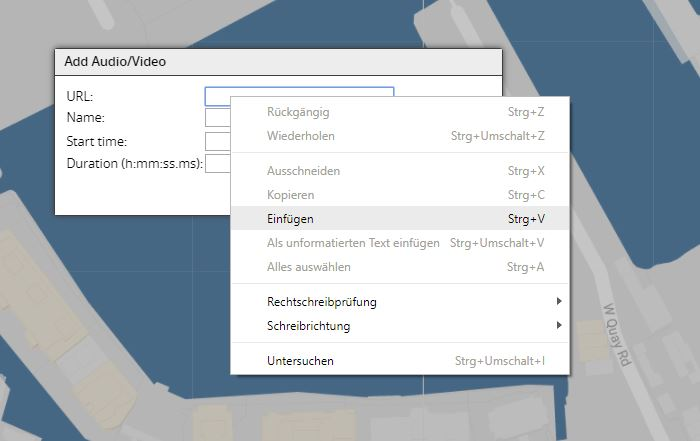
  
* Wait for the autodetection. The autodetection will prefill starttime and mimeType with information that can be derived from the video itself, please check that:  
the MimeType is set to mp4panorama in case of a 360 video, or mp4 for a normal 2D video   
Ensure a proper starttime is set, this should be the time, when the recording of the video was started.  With the Set to default button, the starttime of the video can be set to the start of the race.   It is later possible to properly synchronize the video, if a small delay exists, so this does not have to be perfect, but the fine synchronization is easier if it is close.  
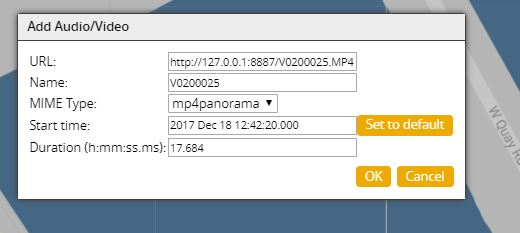
  
* Close the Dialog with OK, a small video player should appear (it's content might be black, this is ok), if it does not appear please try reloading the page
* Using the edit button and the various +&- increment buttons, the video can be fine synchronized if required, do not forget to click save if adjusted  
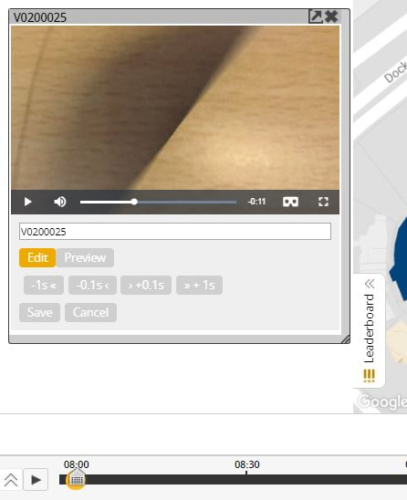
* Once the timeSlider is within a valid range (determined by the starttime and duration of the video) the player will start and play concurrently with the map.

