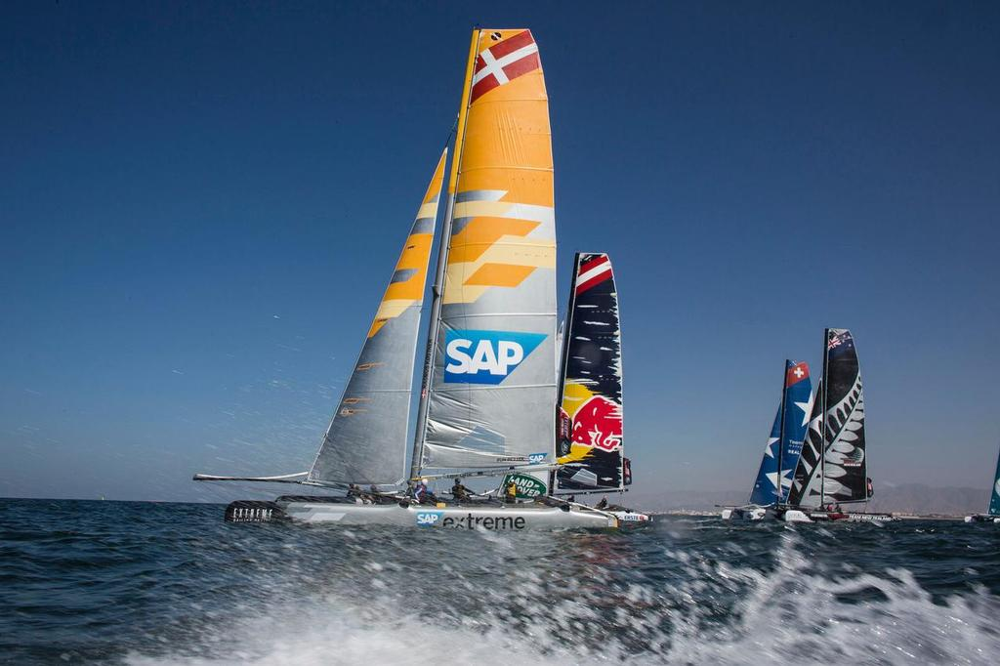

  

<h1>🏆 SAP Sailing How-To Tutorials</h1>

<h3>📑 Skipper’s Handbook</h3>
<ul>
  <li><a href="#sap-sailing-how-to-tutorials">🏠 Home</a></li>
  <li><a href="#sail-insight-application">⛵ Sail Insight</a></li>
  <li><a href="#sap-sailing-race-manager-application">🏁 Race Manager</a></li>
  <li><a href="#sap-sailing-analytics">📊 Sailing Analytics</a></li>
  <li><a href="#happy-sailing">⚓️ Contact</a></li>
</ul>

    <blockquote>
      🚀 <em>Welcome to the SAP Sailing knowledge base!</em> 
      Use this guide to access step-by-step tutorials for each of these tools:
      <strong>Sail Insight</strong>, <strong>Sailing Race Manager</strong>, and <strong>Sailing Analytics</strong>.
    </blockquote>
    

    <h2 id="sail-insight-application">⛵ 1. Sail Insight Application</h2>

    

      
      

        
<em>Set up events, invite competitors, manage courses and marks, edit results and start sailing smarter.</em>

      

    

    <h3>Guides:</h3>
    <ul>
      <li><a href="sailinsight/getting-started.md">Getting started with Sail Insight</a></li>
      <li><a href="sailinsight/create-events.md">How-to: Create an event with Sail Insight</a></li>
      <li><a href="sailinsight/manage-marks.md">How-to: Managing marks in Sail Insight</a></li>
      <li><a href="sailinsight/boat-team-creation.md">Boat and team creation in Sail Insight</a></li>
    </ul>
    
You can also visit <a href="sailinsight/faq-answers.md">FAQ & Answers</a> for common questions.

    

    <h2 id="sap-sailing-race-manager-application">🏁 2. SAP Sailing Race Manager Application</h2>

    

      
      

        
<em>Connect your devices, manage wind settings, edit results, and master your races.</em>

      

    

    
The SAP Sailing Race Manager app simplifies starting, running, and finishing sailing races, with real-time updates for organizers, fans, and media.

    <h3>Guides:</h3>
    <ul>
      <li><a href="sailingracemanager/connect-to-event.md">How to connect the Race Manager App to an Event</a></li>
      <li><a href="sailingracemanager/configure-wind-settings.md">How to configure wind settings</a></li>
      <li><a href="sailingracemanager/sailing-race-guide.md">How to work with the SAP Sailing Race Manager App</a></li>
      <li><a href="sailingracemanager/edit-results.md">Editing results with the SAP Sailing Race Manager App</a></li>
    </ul>

    

    <h2 id="sap-sailing-analytics">📊 3. SAP Sailing Analytics</h2>

    

      
      

        
<em>Dive deep into race tracking, data mining, and event publishing.</em>

      

    

    
 SAP Sailing Analytics uses Cloud and In-Memory Technology to process GPS and wind data in real time, delivering insights for organizers and competitors.

    <h3>All Tutorials:</h3>

   

<table class="guide-index">
  <colgroup>
    <col />
    <col />
  </colgroup>
  <tbody>
    <tr>
      <td><a href="sailinganalytics/tracking-race-player.md">Tracking Race Player Overview</a></td>
      <td>The video below gives an excellent overview of the main functionality of the SAP Race Player which is accessible on a per-race basis via the “Races/Tracking” tab of a regatta.</td>
    </tr>
    <tr>
      <td><a href="sailinganalytics/sign-up.md">Signing up for a user account</a></td>
      <td>This tutorial will show you how to sign up for a user account at the <strong>SAP Sailing Analytics</strong>.</td>
    </tr>
    <tr>
      <td><a href="sailinganalytics/into-to-backend.md">Introduction to Analytics Backend</a></td>
      <td>The guide <strong>General Introduction to SAP Sailing Analytics Backend</strong> will give you a look around the SAP Sailing Analytics <em>Admin Console</em>.</td>
    </tr>
    <tr>
      <td><a href="sailinganalytics/simple-event-creation.md">Create a simple event</a></td>
      <td>This tutorial shows you how to create an event with the SAP Analytics <em>Administration Console</em> on <a href="https://my.sapsailing.com/gwt/Home.html">my.sapsailing.com</a>.</td>
    </tr>
    <tr>
      <td><a href="sailinganalytics/video-tracking-management.md">Add &amp; align Youtube videos</a></td>
      <td>This tutorial shows how to add and align <em>Youtube videos</em> to the <strong>tracking timeline</strong>.</td>
    </tr>
    <tr>
      <td><a href="sailinganalytics/create-regattas.md">Create complex regattas</a></td>
      <td>This tutorial shows how to create <strong>more complex regattas</strong>.</td>
    </tr>
    <tr>
      <td><a href="sailinganalytics/competitors-data-management.md">Edit scores/results</a></td>
      <td>This tutorial shows how to <em>edit</em> scores/results in leaderboards and <em>change</em> competitor data in <strong>the SAP Sailing Analytics</strong>.</td>
    </tr>
    <tr>
      <td><a href="sailinganalytics/importing-results.md">Importing results</a></td>
      <td>The video explains how you can <em>import</em> results/scores from other regatta management systems for which <strong>the SAP Sailing Analytics</strong> have an integration in place, such as <strong>YachtScoring</strong> and <strong>Manage2Sail</strong>.</td>
    </tr>
    <tr>
      <td><a href="sailinganalytics/adjust-mark-position.md">Adjust mark position</a></td>
      <td>This episode shows you how to adjust <em>the position of a mark</em> with <strong>SAP Sailing Analytics</strong>.</td>
    </tr>
    <tr>
      <td><a href="sailinganalytics/set-mark-position.md">Set mark position</a></td>
      <td>This episode shows you how to set <em>the position of a mark</em> with <strong>SAP Sailing Analytics</strong> in case the tracker failed or you were not able to attach a <em>tracker</em> to the mark.</td>
    </tr>
    <tr>
      <td><a href="sailinganalytics/configure-wind-settings.md">Configure wind settings</a></td>
      <td>This tutorial shows how to configure <strong>wind settings.</strong>.</td>
    </tr>
    <tr>
      <td><a href="sailinganalytics/set-up-regattas.md">Set up multiple regattas</a></td>
      <td>This tutorial shows how to set up <em>multiple regattas</em> or <em>classes events</em> with the <strong>SAP Sailing Analytics</strong>.</td>
    </tr>
    <tr>
      <td><a href="sailinganalytics/leaderboard-groups-explanation.md">Leaderboard groups explained</a></td>
      <td>This tutorial explains how <em>Leaderboard Groups</em> work in <strong>the SAP Sailing Analytics</strong>.</td>
    </tr>
    <tr>
      <td><a href="sailinganalytics/split-leaderboard.md">Split a leaderboard</a></td>
      <td>This tutorial shows how to <em>split</em> a leaderboard into divisions with the <strong>SAP Sailing Analytics</strong>.</td>
    </tr>
    <tr>
      <td><a href="sailinganalytics/course-areas.md">Working with course areas</a></td>
      <td>This tutorial shows how to work with <em>course areas</em> in <strong>SAP Sailing Analytics</strong>.</td>
    </tr>
    <tr>
      <td><a href="sailinganalytics/sailing-race-manager.md">Work with Race Manager app</a></td>
      <td>This tutorial explains how to work with <strong>the SAP Sailing Race Manager Application</strong>.</td>
    </tr>
    <tr>
      <td><a href="sailinganalytics/race-manager-connection.md">Connect Race Manager to event</a></td>
      <td>This tutorial shows how to connect <strong>the Race Manager Application</strong> to an <em>event</em>.</td>
    </tr>
    <tr>
      <td><a href="sailinganalytics/edit-results.md">Editing results</a></td>
      <td>This tutorial explains how to <em>edit</em> results with <strong>the SAP Sailing Race Manager Application</strong>.</td>
    </tr>
    <tr>
      <td><a href="sailinganalytics/set-matchrace-event.md">Set up matchrace event</a></td>
      <td>This episode shows you how to set up a <em>matchrace event</em> with <strong>the SAP Sailing Analytics</strong>.</td>
    </tr>
    <tr>
      <td><a href="sailinganalytics/security-system.md">Security system intro</a></td>
      <td>This episode serves as an introduction to the <em>security system</em> of the <strong>SAP Sailing Analytics</strong>.</td>
    </tr>
    <tr>
      <td><a href="sailinganalytics/default-creation-group.md">Default creation group</a></td>
      <td>This episode shows how to set a default <em>creation group</em> in user details with <strong>the SAP Sailing Analytics</strong>.</td>
    </tr>
    <tr>
      <td><a href="sailinganalytics/make-group-public.md">Make group public</a></td>
      <td>This episode shows how to make everything your group owns <em>readable</em> for everyone in <strong>the SAP Sailing Analytics</strong>.</td>
    </tr>
    <tr>
      <td><a href="sailinganalytics/publish-event.md">Publish an event</a></td>
      <td>This episode shows how to <em>publish an event</em> through a dedicated user group in <strong>the SAP Sailing Analytics</strong>.</td>
    </tr>
    <tr>
      <td><a href="sailinganalytics/import-gpx-track.md">Import a GPX track</a></td>
      <td>This episode shows how to import a track from a <em>GPX file</em>.</td>
    </tr>
    <tr>
      <td><a href="sailinganalytics/race-fixes.md">Fix device assignment</a></td>
      <td>This episode shows how to <em>fix</em> races when a device is assigned to multiple competitors <strong>accidentally</strong>.</td>
    </tr>
    <tr>
      <td><a href="sailinganalytics/data-mining-tool.md">Data Mining Tool intro</a></td>
      <td>This tutorial gives an introduction to <strong>the SAP Sailing Analytics Data Mining Tool</strong>.</td>
    </tr>
    <tr>
      <td><a href="sailinganalytics/copy-course-to-race.md">Copy course to race</a></td>
      <td>This tutorial explains how to copy course to other race.</td>
    </tr>
    <tr>
      <td><a href="sailinganalytics/dset-up-course.md">Course set up</a></td>
      <td>This tutorial explains how to set up course in <strong>AdminConsole</strong>.</td>
    </tr>
  </tbody>
</table>

    

    <h2 id="happy-sailing">⚓️ Happy Sailing!</h2>

    <blockquote>
      💡 <strong>Tip:</strong> Bookmark this page for quick access. 
      For more help, contact support at: <a href="mailto:support@sapsailing.com">support@sapsailing.com</a>.
    </blockquote>

  

