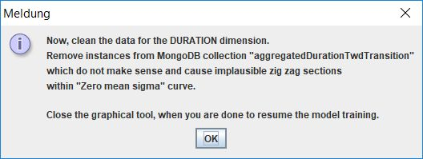
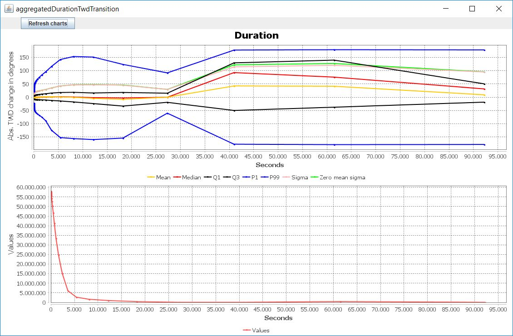
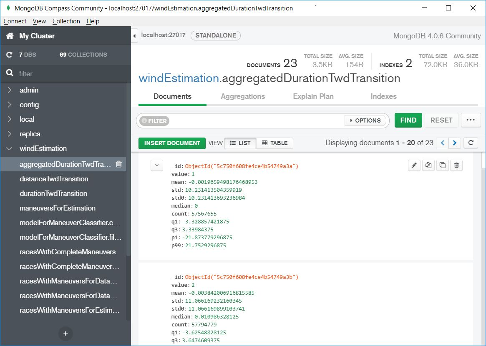
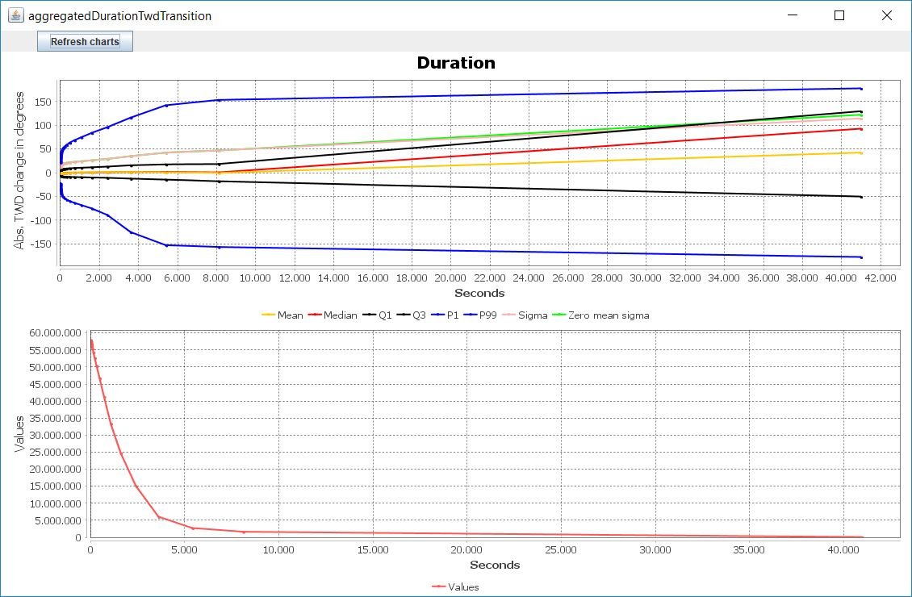
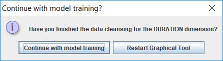

# Training of internal Wind Estimation models

This document describes the generation process of Machine Learning (ML) models which are used internally by the maneuver-based wind estimation. It is highly recommended to process this howto step by step considering the order of sections. At the end of this howto, you will generate a file containing the representation of internal models used by ``com.sap.sailing.windestimation`` bundle. You can use this file to update the wind estimation models of a running server instance. If you are interested in a more advanced tutorial which requires all the execution steps contained in ``SimpleModelsTrainingPart...`` classes to be executed manually, then you might be interested in [Advanced Guide for training of internal Wind Estimation models](./windestimationAdvanced.md)

## Prerequisites

To complete the training process successfully, you need to make sure that you have the following stuff:

* A complete onboarding setup for SAP Sailing Analytics development
* MongoDB (**3.4 or higher!**) is up and running (can be the same MongoDB instance as required in onboarding howto)
* At least 100 GB free space on the partition, where MongoDB is operating
* Installed graphical MongoDB client such as MongoDB Compass (Community version)
* 16 GB RAM
* 24+ operating hours of your computer

## Model training process

1. Run ``com.sap.sailing.windestimation.model.SimpleModelsTrainingPart1`` as a normal Java Application. After this, all the necessary maneuver and wind data will be downloaded, pre-processed and maneuver classifiers get trained.
2. Make sure that the launched program does not get terminated by an uncaught exception. Wait until a graphical info dialog shows up which asks you to perform data cleansing for the duration dimension.
   
   Press OK. Afterwards, a graphical window must open with two charts. The top chart is an XY-chart where the x-axis represents **seconds** and the y-axis represents various TWD delta-based measures (e.g. standard deviation or mean). Below the XY-chart, a histogram for the data points of the XY-chart is provided. You can zoom-in and zoom-out in each of the charts by mouse dragging. Be aware that currently the zoom level of both charts is not synchronizing.
   
3. Open your graphical MongoDB client and connect to the ``windEstimation`` database hosted within your local MongoDB. Open the collection named ``aggregatedDurationTwdTransition``. Within the collection you will see all the instances/data points visualized in the previous step. The attribute used for the x-axis is ``value``. Its corresponding metrics plotted in y-axis are the other attributes. ``std`` represents standard deviation (``Sigma`` curve in XY-chart) and ``std0`` represents standard deviation with zero as mean value (``Zero mean sigma`` curve in XY-chart).
   
4. Delete all the instances within the collection which do not make sense. For this, use the data visualization tool from step 2 to identify such instances. Some of the instances are not representative due to the small number of supporting instances which is visualized in the histogram. Such instances can produce unreasonable bumps in the XY-chart. The desired output of this step is that the curve ``Zero mean sigma`` looks smooth and always growing, e.g. as depicted below:
   
   Use the ``Refresh charts`` button as often as needed to update the charts with the modified data in MongoDB. Close the graphical visualization tool window after you are done with data cleansing to resume the training process. A confirmation dialog shows up. Confirm it by pressing *"Continue with model training"* button.
   
5. A new information dialog shows up requesting you to open the source code of the class ``com.sap.sailing.windestimation.model.regressor.twdtransition.DurationBasedTwdTransitionRegressorModelContext``. Open it and scroll down to the definition of the inner enum ``DurationValueRange``. The enum defines the intervals for which a separate regressor model will be trained. Read the Javadoc of ``DurationValueRange`` and adjust the intervals accordingly in order to allow the regressor model to learn the ``Zero mean sigma`` curve with minimal error. You can also configure the polynomial which will be used as regressor function. Make sure that there are at least 2 data points contained within each configured interval. The data point with x = 0, y = 0 will be created automatically within the model training procedure. Press OK in information dialog after you are done.
6. A graphical info dialog shows up which requests you to perform data cleansing for the *distance* dimension. Press OK. All steps for data cleansing for the distance dimension are analogous to the steps of the duration dimension described from step 2. until step 5. Thus, consult these steps in order to complete the data cleansing for the distance dimension. The unit used for the distance representation is **meters**. The collection name required in step 3. is ``aggregatedDistanceTwdTransition``. The class required in step 5. is ``com.sap.sailing.windestimation.model.regressor.twdtransition.DistanceBasedTwdTransitionRegressorModelContext`` and its inner enum is ``DistanceValueRange``.
7. Run ``com.sap.sailing.windestimation.model.SimpleModelsTrainingPart2`` as a normal Java Application. Wait until the model training finishes and the program terminates normally. A new file with serialized representation of internal wind estimation models should be located in ``./windEstimationModels.dat``. The absolute path of the file must be printed in the console output of the program. You can upload the file via HTTP POST to http://sapsailing.com/windestimation/api/windestimation_data (see ``com.sap.sailing.windestimation.jaxrs.api.WindEstimationDataResource``) to update the wind estimation of a server instance. If you changed the source files of ``DurationValueRange`` or ``DistanceValueRange``, then you will need to update ``com.sap.sailing.windestimation`` bundle of the server instance which is meant to receive the new wind estimation models.
8. Optionally, run ``com.sap.sailing.windestimation.evaluation.WindEstimatorManeuverNumberDependentEvaluationRunner`` as a normal Java Application to evaluate the wind estimation with the new trained models. The evaluation score will be stored as CSV in ``./maneuverNumberDependentEvaluation.csv``.