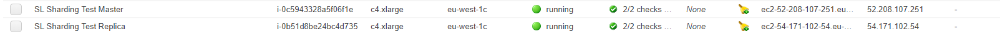
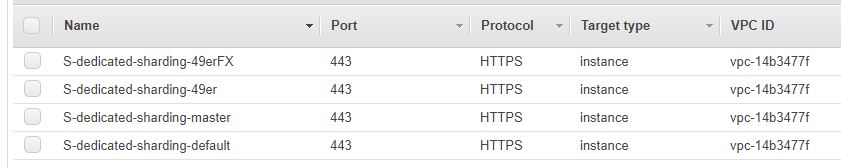
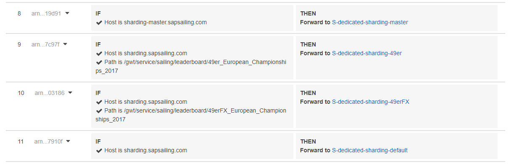

# Amazon EC2 for SAP Sailing Analytics

[[_TOC_]]

## Sharding

#### Servers

- For a minimum Setup at least 2 Servers are required.
- One server is required to be the master server as in usual replication situations
- All other servers are required to be replicas

e.g. a simple example:

 
#### Routing Setup

Multiple target groups must be defined per routing target.

Interesting here are the groups named after leaderboards (or other discriminators).

The names of the target groups can be defined however fitting, e.g. multiple leaderboards can be routed to each, in this example the leaderboard name is used for simplicity.

The interesting part is the configuration of the load balancer:

It is recommended to have a route with a dedicated hostname going specifically to the master!, as else it might not be possible to reach the non replicated AdminConsole!

It is required to have a default route, that can go to any server, because there are some requests that are not specific to leaderboards, and still need to be processed.

For each Leaderboard that should not go to the default group, a entry is required. To discriminate between leaderboards, they are encoded into (mostly) all requests. 

This allows to specify a path based routing. The path are "/gwt/service/sailing/" and "/gwt/service/dispatch/" and the routing relevant suffix is leaderboard/underscore\_escaped\_leaderboardname. 

All non  a-z,A-Z,0-9 characters are replaced with \_. 

This is because limitations in the ALB do not allow the unmodified URL encoded leaderboard name.

In case it is unclear how the name of a leaderboard is, the REST api of the master server can be asked for this.  (after creating the leaderboards)

NAME\_OF\_LEADERBOARD\_YOU\_NEED\_TO\_KNOW\_THE\_PATH\_OF is the same name as in the admin console, the browser will do all required url encoding for this

https://www.sharding-master.sapsailing.com/sailingserver/api/v1/leaderboards/NAME\_OF\_LEADERBOARD\_YOU\_NEED\_TO\_KNOW\_THE\_PATH\_OF/

eg:
https://www.sharding-master.sapsailing.com/sailingserver/api/v1/leaderboards/ESS 2016 Cardiff

This will return a JSON document with the leaderboard name encoded near at the end:

"ShardingLeaderboardName":"\/leaderboard\/ESS\_2016\_Cardiff", please note that the response is encoded, to get the proper name this needs to be decoded first e.g using some json parser.

Please note that the example image is missing the dispatch related rules!

If you need to use the REST api for other applications, we suggest to use the master server directly, as else the requests would need to be replicated to the master server anyway.