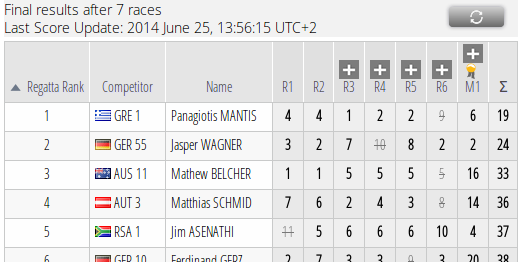
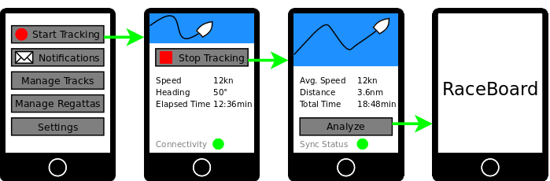

# SAP Sailing Analytics - Tracking App Specification
## Abstract
Integrating smartphones into the _Sailing Analytics_ has long been talked about, and some effort has been invested on the server side to implement this idea. So far, the smartphone side of things has received substantially less attention, even though it is probably the most essential part when it comes to making the solution desirable for sailors. The missing parts on both sides and a high-level specification for the app are presented here.

## Table of Contents
[[_TOC_]]

<!-- Gollumn and python-markdown have a different syntax for the TOC :( -->

<!--[TOC]-->

## A lengthier Introduction
The _SAP Sailing Analytics_ use tracking data to allow users to analyze sailing regattas in their browser - both on a regatta level, covering multiple races in tables called _Leaderboards_, and on a per-race level through map-centric interactive views called _RaceBoards_. The Sailing Analytics are currently targeted at large sailing events. Dedicated tracking providers collect and send the positional data of the sailing boats along with competitor metadata, and trained personnel that knows the Sailing Analytics inside out operates them on-site, for example by maintaining the regatta data (regattas, races, fleets, result corrections etc.).

    
    
<b>Leaderboard</b>: a tabular view of races

    
    
<b>RaceBoard</b>: a customizable combination of different elements (e.g. Leaderboard, map, charts)

We believe that the Sailing Analytics's functionality can benefit sailors not only at large sailing events, but for many more occasions. Among other devices, smartphones can serve as a source of tracking data, and sailors can define their own training races or even club regattas, so that they can then analyze their tracks. This would shift the Sailing Analytics from being a fully-provided event solution to a (possibly freely) availabe online tool that sailors can use whenever they want. One can see how this idea has the potential to make the Sailing Analytics and all the work that has been put into them so far more visible and accessible, ultimately transforming it into a tool every sailor knows and loves to use.

Plenty of thought has been put into adapting the existing software on the backend side, yet the smartphone tier has received far less attention so far. To bring the idea to life the technical backend is vital, but an intuitive, easy-to-use - "sexy" - smartphone app has the highest impact on how the overall solution comes across to the end user - the sailor.

Obviously, the base functionality of such an app is to provide a service that gathers positional data and transmits it to our backend. The more challenging part however lies in reducing the interaction that currently experts perform through the _AdminConsole_ (a web-based administrative interface) to the minimal and intuitive subset that end users want to perform.

This document details out what is still missing both on server and smartphone side, aiming to serve as a specification for the furhter implementation. As the app plays such a crucial part in the overall story, and as it has received so little attention so far, one possibility is to outsource its design and implementation, so that the the document also serves as a high-level requirements specification.

Missing parts and requirements are summarized throughout this document with the following color-coding:

!!! app
    Requirements concerning the app only.

!!! server
    Requirements concerning the server side only.

!!! both
    Requirements involving both the smartphone and server tier.
    

First the use cases for the tracking app are presented, which should give a good understanding of the app strcuture and scenarious we envision the app to be used in. This is followed up with other features that are relevant for the app, apart from the main uses cases. Finally, a technical addendum introduces more technical aspects, beginning with the app, and moving to backend implementation details.

## Use Cases
The proposed smartphone app should enable casual users to apply the Sailing Analytics to their own tracking data. The following paragraphs describe the most important use cases in this context from the viewpoint of the users, leaving the technical details for a later section. The use cases are ordered by their importance - the ones that should be supported first are presented first.

### Individual Training

This can be considered as being the simplest use-case. After downloading the app, the sailor creates a user account. Alternatively, he may log in to an existing account. As is common for apps this login should persist across app and phone restarts, until the users explicitly logs out. The user data could also serve as the basis for the competitor data (for which additional information about the country, sail-number and boatclass is required).

!!! server
    Clarify how user and competitor management play together. Are they entirely separate, and a user can create different competitors for his account, and switch between them, or is a user the same thing as a competitor? What happens, e.g., if a user switches to a different boat - changing the boat class and sail-number in his user preferences would cause wrong information for old races. Instead of having to login with a different user, instead the user might select from the list of competitors he has created from that account, or choose to add a new one.

On the following start screen there is a dominant button for starting the tracking - this functionality has to be readily available at all times, as missing out on tracking data is the potentially worst thing that can happen - everything else can be done later on. During tracking, the following information should be shown:

* warning if GPS signal is unavailable
* connectivity status (pending fixes that need to be sent to the server)
* a few basic metrics (speed, heading)
* possibly a map representation of the track

All the above information can be presented in an offline situation - the user can start tracking, in which case the fixes are only buffered locally, and speed and heading can be directly extracted from the GPS module. Other data interesting for the user, which oftentimes relies on wind information, could be provided in an online setting:

* wind strip charts
* VMG  
* manoeuvre loss

There are probably plenty more figures one might want to display, and one screen for displaying this may not be enough. Different variations are possible: the user might configure what information to show, be able to switch between different information screens, or these might alternate automatically (e.g. every 5 seconds) to allow hands-free operation.

The tracking itself should be able to run in the background - the tracking screen itself then displays additional information. But without influencing the tracking, the user should be able to continue using other apps, or also this app and e.g. already define a race structure, or share a link to this training session without interrupting tracking.

!!! server
    Providing the calculated figures, most of which are wind-related, requires the existence of a TrackedRace on the server. In the absence of such, either the user could be prompted to create one, or a placeholder TrackedRace could be created for every tracking session for which a user has not manually created a TrackedRace or accepted an invitation.

After stopping the tracking, a summary of the data can be given, including the transmission status. For this simple scenario, selecting an _Analyze_ button sets up a race with this competitor and all necessary data automatically, so that the user can proceed to directly analyze his training session in the RaceBoard.

!!! app
    As already mentioned, tracking, storing and transmitting the fixes should be handled in a crash-safe background process, with the goal of not loosing any tracking data. Switching to a different app, or moving away from the tracking screen within the app (e.g. to start defining the race) should not influence the tracking - it should only be stopped when explicitly requested.

### Race
Multiple competitors want to compete in a race and let their friends on shore get a real-time impression of what is happening on the water. One of them defines the race on his smartphone, for which he enters the basic data and then invites his friends to join through the app. On the water, they lay out the marks for the course, and while laying out each buoy they ping their location at that moment. From these pinged buoys they can define the course layout.

!!! app
    Users should be able maintain friend lists, so that they can easily invite other users they often interact with. But if a group of competitors sail together that do not know each other, the process of adding each of the competitors by his username is slow and tedious for the user managing the race. Instead it should be possible to exchange invitations via NFC and/or a QRCode that is displayed on the screen of the managing user. Everybody who scans this QRCode or touches their phone to that managing user's phone while in _invitation mode_ could be automatically added to the race.

If no other wind data is available (e.g. no wind sensor is tethered to one of the smartphones), the opportunity to manually enter the wind data should exist. Different possibilities exist, either by entering the wind angle and strength in numbers, or for example hitting a _Set Wind_ button at the moment when the boat is pointed directly into the wind - then relying on compass data and a proper orientation of the smartphone within the boat (or possibly corrected by COG information if the boat was previously moving).

After entering a start time, everything happens automatically. A countdown commences on all of the smartphones - all have been automatically informed of the start time. The app automatically begins tracking a few minutes before the start of the race, and stops once the boat has crossed the finish line.

The analyze button that links to the RaceBoard is visible to the other invited users as well. To let others view the race analysis, a link can be shared - which should include a sufficiently long random component to make links of races that should not be shared non-guessible (cf. to the _Anyone who has the link_ sharing option of Google Docs). Having been sent this link, the friends on shore see a live RaceBoard view of the sailboats. For example, after the race as finished, a standard _Share_ button for that mobile platform should be displayed.

If no mobile connection is available, the steps of defining the race, and inviting the other competitors can be postponed. Instead, everybody just starts and stops tracking manually. Once everybody is back on shore and has internet access (e.g. through a WiFi hotspot int he club house), the race can the be defined for a timespan in the past. The invitations are sent out just the same, and by accepting, the others make their tracking data for the span of the race available.

After having a look at the race in the evening, our sailors notice that they apparently pinged the marks of the windward gate in the wrong position, and decide to adjust the course through the app.

!!! server
    This use-case gives some insight into the further details of user management. An authorization mechanism will have to be put into place, that encompasses the following data: Event-Race structure, RaceLog and tracking data. An initial approach could be to allow editing of such structures only by the user that created them, and grant explicit read permissions to other users. The other participants in the race can grant read access to their tracking data for the duration of the race, and the creator of the race in turn grants read access to his TrackedRace (and the RaceLog, and implicitly the RaceBoard). We then have to start enforcing these access rights, which might be possible on multiple levels. This might be done on a servlet level by adding security constraints to the ``web.xml``s, or checked within the application (or perhaps both). Also, one would have to go about securing the GWT-RPC communicatin channel.

!!! both
    The app in turn must support managing these rights - in part this may be implicit (accepting an invitation = granting read access to tracking data), but for other parts an explicit interface might be necessary (sharing a race with other users). The topic may be extended to managing groups, and group-based access permissions (e.g. for sailing clubs).
    
!!! both
    The first method described to define a course is the simple case: individual marks are pinged with a fixes location, and then combined into gates, lines or kept as individual marks and brought into order that makes up the course. This should be possible from the app, and a map-view of the current course (mark positions, gate/line combinations, directions of the legs) should be offered to provide a visual feedback on whether the course layout is correct. The post-race course definition and course editing is slightly more complex, and should ideally show the competitor tracks, as these offer a good indication of where which WayPoint was. Also this might offer the possibility to slightly alter the positions of the marks throughout the duration of the race in case of drifting buoys. To give full flexibility, users should ideally be able to add and delete individual pings, which act similarly to keyframes with automatic interpolation of the position inbetween - the only problem is that right now fixes cannot be deleted from a track. What functionality should be available from the app or a desktop version is discussed later.

### Regatta
If the solution becomes nice enough to use, sailing clubs will possibly want to use the Sailing Analytics for their own regattas in the same fashion they see them used at larger events. In this case, the functionality for defining the Event-Race and Leaderboard structure currently only accessible through the admin console would have to be exposed through the app.

Defining an easy-to-use wizard for defining such a regatta structure is probably time-consuming. It should contain sensible defaults, so that for the common cases creating such a regatta is as easy as possible, but potentially the wizard should offer full flexibility.

!!! both
    The management of events, associated regattas, series, fleets, races and leaderboards should probably best be exposed through a RESTful API. When this point is reached, it makes sense to discuss if every possible detail must and should be exposed, or if a subset may be enough to cover most cases, and make it as easy as possible for users.
    
### Combining individual Training Sessions
A user might wish to compare several of his individual sessions on one course, or different users that sailed the course at different times might want to virtually combine their tracks into a race, as if they had sailed at the same time.

As soon as the start line is defined, the first crossing of this line after the beginning of a tracking session can be used as the start time for that competitor. By aligning the competitor tracks by their individual start times, a virtual race can be created.

!!! server
    This is a new feature, as up to now we have only considered physical times and had no need to build virtual views with adjusted times. A simple possibility might be to define a time offset for every track on the creation of a TrackedRace, so that incoming fixes are adjusted by that offset. Whether this feature is needed should be discussed.

## Further Features

### Multimedia Integration
Of course a smartphone is the perfect source for further multimedia that enriches the race. This might be videos, photos, notes or audio recordings that are linked to the timepoint at which they were taken/added. During tracking, the app should offer possibilities to take a photo/video/notes, which are then automatically uploaded when an internet connection is available, and linked to that point in time.

!!! server
    Managing arbitrary multimedia is a totally new feature. On the one hand, this multimedia has to be stored - though it might be possible to outsource this (photos on Flickr, videos on Youtube). Then these should somehow be linked to the corresponding timepoints, and might appear in the timeline of the RaceBoard, or maybe as a list in the app.
    
### Additional Sensors
Smartphones can act as the intermediary for data from further sensors. On the one hand, the integrated sensors (e.g. gyroscope/accelerometer) can provide potentially useful information - these can be polled in a standardized API. On the other hand wind sensors or others connected via bluetooth/WiFi can be an extremely valuable source of information.

The app should allow configuration of what additional sensor data to collect. This sensor data should be handled similarly to the tracking data, in that it is uploaded whenever a mobile connection is available. If the bandwidth is limited, or the connection is on and off, then the tracking data should be prioritized, so that if possible the newest tracking data is the first thing to arrive at the server.

To keep down the complexity, it is probably sensible to only support such sensors which can be polled from within the app. In this case, the user can configure what sensors data to collect, and this data is automatically linked to that race the user participated in during that time. Of course, this would probably restrict the sensors to a list of those sensors we explicitly support.

!!! server
    Wind data is already part of the domain model, but with more types of data becoming available (heartrate, gyroscope), we have to think about a suitable mechanism for storing, linking and somehow displaying arbitrary data. For example, sensible aggregations on certain data types might be defined, and if present these could then be added as columns to the Leaderboard, and also presented as charts.

!!! both
    Whether the proposed approach is viable depends on how the available external sensors that can be tethered to smartphones can be polled - is this even possible from within the tracking app, or are these devices built to only work with the dedicated app the manufacturer of the sensor offers? This approach also limits the user's choices in sensors to those that we explicitly support, unless there is a standardized access to e.g. all external wind sensors. But this would allow us to offer live transmission of additional sensor data to Sailing Analytics - most valuable probably for wind. Another possibility is to offer import capabilities for standard formats (e.g. wind data in NMEA or gpx format). What formats are supported depends on what existing devices offer as an output format, this would open us up to support more devices, but create an additional step for the user. Offering both possibilities might be best.
    
### Battery Life Management
After a few hours of tracking with the display turned on the whole time - displaying the tracking status information - the smartphone battery will likely have been depleted rapidly. To guarantee that the most important data - the tracking data - is collected in any case, the app should act in a battery-level-aware fashion.

There are plenty of different options for extending the battery life that can be influenced by the app:

* polling rate (GPS position, additional sensors)
    * to stretch the battery life as long as possible, all sensors but the GPS module could be disabled, and the polling rate for GPS could be reduced to the slowest sensible setting
* connectivity
    * disabling sending of tracking and other sensor data completely and only buffering locally will extend battery life
    * if calculated figures from the TrackedRace, which have to be synchronized via the mobile network, (e.g. VMG) are integrated, this polling can be disabled to extend battery life
* display (brightness, turn off automatically)

So in the most battery-saving mode, the app could let the display turn off after a few seconds of inactivity, and only poll the GPS position every second, writing it directly to local storage without trying to send it.

For some cases it makes sense to allow the user to choose a battery-saving mode even if the battery is full, e.g. if he knows he will want to use the app throughout the day and won't have a chance to recharge the phone. This could e.g. be accomplished by providing different preconfigured _energy profiles_ (as known from Microsoft Windows) that are automatically selected depending on the battery level, but which may be overriden by the user.

### Adapted RaceBoard for Smartphones
As mentioned in the introduction, next to the Leaderboards, the RaceBoards are the main user-facing views on the tracking data. Currently, such a RaceBoard is available only as a web-application in the browser, and targeted at desktop computers. It can be viewed with tablets that provide a decent screen resolution, but the interaction (button size, interacting with the map view) is not aimed at smaller touch-enabled devices.

    
    
<b>Existing RaceBoard (in-browser)</b>

On smartphones, there is definitely not enough screen estate to display the RaceBoard in its current status. However, users that defined a race and tracked their boats with the app should also be able to analyze the race using their smartphones.

To integrate decently with the rest of the app, this smartphone-RaceBoard should be implemented using the same technology stack - that is as part of the native app, if the native app is chosen (see <a href="#native-vs-hybrid">Technical Considerations</a> on this).
Instead of combining everything into one single screen, the suggested approach for the app would be to divide the functionality up into different screens, possibly leaving some functionality out. The main components _Leaderboard_ and _RaceMap_ might be separated into two tabs, between which one can easily switch, where the time slider remains fixed at the bottom for both these tabs. Further tabs could show charts for wind or competitors.

The Leaderboard is a pretty complex table. It includes several levels of hierarchy, where the user can drill down into races and legs with his web-browser. This hierarchical structure is presented as expandable colums, so that e.g. expanding the column for one race results in several additional columns being displayed for each leg of that race. This is basically a drill-down operation, which might need to be implemented with some different interaction mechanism in the app. Perhaps standard interaction patterns exist for this type of functionality. Possibly, instead of expanding the entire column, by selecting a row (representing one competitor) further details on the races/legs for that competitor can be displayed on a different screen.

!!! server
    To enable other RaceBoard and Leaderboard clients than the GWT-RaceBoard, all necessary data has to be exposed not only through the GWT-RPC channel, but also e.g. through RESTlets.

### Managing Tracks and Races
An important part of the app surely also lies in managing the existing tracks and races generated from these tracks. On the one hand, the user may simply wish to see what tracks are on his phone (and what their synchronization status to the server is), and browser through his races. The list of races then serves as an entrypoint for analysis or sharing.

### Start Line Analysis
This app is targeted at sailors as users - enabling them to track and analyze their own training sessions and races. To improve, a sailor needs to know which part of his performance can be optimized.  Apart from the RaceBoard, a detailed start line analysis can be helpful. Interesting figures include:

* distance to start line at time of start
* start on left or right side of line
* on which tack was the boat at time of start
* speed on crossing the start line
* speed at time of start
* rank for the first few 10s-intervals (rank at 10s/20s/... into the race)

In addition to the figures for the own boat, these figures could be compared to those of other competitors when analyzing a race. By doing so, a sailor can learn what others are doing better or worse than him.

### Social Media Integration
Enabling social interaction within the app can increase the visibility of both the app and the Sailing Analytics. Part of this is allowing users to invite others to participate in a race. Social interaction within the app is one part of this: users can invite other users to participate in their race, and communicate directly e.g. by setting the start time.

Connecting to existing social networks and communication channels is another simple yet effective measure to this end. A race or regatta (represented by a URL) can be easily shared through these. 
The URL should be handled by the app if available. Otherwise a mobile representation of the requested site should be rendered, ideally with an additional recommendation on installing the app.

## Technical Addendum
This addendum addresses more technical issues that seem obvious from the point in time of writing this documentation. More technical issues will surely arise during implementation, but the following sections try to cover the larger areas that can already be foreseen.

As the use cases for the app were described above already, the following paragraphs rather focus on the technical considerations for the app, which functionality should also/only be available through a desktop computer, and changes to the backend.

### Technical Considerations for the App

As we ultimately want to reach as many users as possible, we will want to target different smartphone platforms. With this in mind, the different possibilities for developing cross-platform apps should be considered.

hybrid / container-based
:   Cross-platform development options such as PhoneGap supposedly offer the advantage of only having to develop the app once, and use it on any supported platform. This may come at the price of reduced performance, and not having the native look-and-feel in all aspects, which users have come to expect for apps. A major topic to address here is whether the tracking, buffering and transmission part of the app can feasibly be implemented in such a hybrid solution.

native
:   While native apps offer full flexibility, they come at the cost of having to maintain multiple code bases, which are supposed to provide the same functionality, but for different platforms. If starting out with Android as the first supported platform, code reuse as for the RaceCommittee App would at least be possible.

### Smartphone vs. PC
So far all functionality for smartphone tracking has been described in such a way, that all steps from defining a race, tracking it (obviously, as the smartphone is the tracker), up to sharing and analyzing it are possible using the smartphone. At least for the last part, some users may want to deviate from this, and take advantage of the screen real estate and more advanced interaction capabilities offered by a computer to view the RaceBoard, if they spend some time to analyze the race. 

The question arises, which other steps should also be made accessible through a web interface. Possible steps include

* defining a regatta, where multiple steps and quite some text entry is required
* inviting competitors, if e.g. they sent their user names per email
* defining the race course post-hoc, while being able to view the tracks in the background to see where the waypoints should go
* managing one's list of tracked races including sharing options (who may see what), and the ability to share races using the desktop computer

Basically, this means duplicating functionality (maybe even for the third time: complex regatta management in the AdminConsole, simple wizard on the smartphone, intermediate one in the Smartphone-Tracking web interface) to allow user to perform difficult or more complex tasks at their computer. This does not have to be implemented immediately, at least we can wait to see for which steps users would like to see this possibility most.

### Necessary APIs
The various components of the app that have been described have to interact with the existing Sailing Analytics backend. Some of these interactions are entirely new, others already exist - but only for the web interface (through the _GWT-RPC_ channel). Other interactions again are already available in the form of _RESTful JSON APIs_ which are used by the RaceCommittee App. The following list gives an overview of the data and interactions which span both mobile device and backend.

* Account Management
    * Creating an account
    * Logging in
    * Searching user list
* Competitor Management
    * Creating a new competitor
    * Editing an existing competitor
* Submitting GPS Fixes
* Submitting further sensor data and multimedia
* Track Management
    * Retrieving list
    * Defining visibility
* Race Management
    * Retrieving list
    * Creating a race
    * Course definition
    * Setting start time
    * Inviting users
    * Defining visibility
* Regatta Management
    * Retrieving list
    * Creating a regatta
    * Adding a race
    * Defining visibility
* RaceBoard
    * Variety of measurements and calculated figures

### Backend Implementation Details

#### Receiving and storing Tracking Data
So far, the Sailing Analytics did not store any competitor or tracking data. Rather, only the regatta structure was persistently defined, and all other information was provided by the tracking provider. We have begun digressing from this concept in the interest of enabling smartphone tracking.
user
Along these lines, one of the major extensions is storing tracking data. GPS fixes can now be added to the so-called _GPSFixStore_ at any time. A _DeviceIdentifier_ is stored with every fix which identifies the device that generated the fix. An exemplary servlet exists that can process ``HTTP POST`` requests containing a JSON representation of the DeviceIdentifier and multiple GPSFixes. For the final app different alternatives with less protocol overhead should be explored. Options might include websockets or direct socket communication (possibly UDP datagrams in a fire-and forget style, which would require application level handling of lost data).

!!! both
    Investigate efficient and robust transmission mechanisms for GPS fixes, e.g. websockets or socket-based communication.

On the smartphone, a separate service should gather the tracking data and transmit it to the server through whatever mechanism is deemed ideal with regards to the above discussion. Dealing with potential disconnects is crucial, as this may happen when off-shore. App crashes or restarts should not lead to the loss of tracking data. Depending on the communication mechanism the service may or may not be aware of what fixes were successfuly transmitted. For both cases, the app should guarantee that eventually all fixes are transmitted to the server. The server can deemed to handle duplicated fixes in a idempotent fashion, so that it is safe to retransmit a fix if in doubt whether the previous transmission was succesful. However, the app should aim at transferring the minimum amount of data necessary to ensure that all fixes arrive at the server.

!!! app
    Implement a tracking and sending service that can handle app crashes, restarts and network disconnects and guarantee that eventually all fixes are transmitted to the server.

#### Domain Model surrounding a Race
As mentioned, the entire solution is currently focused at large events. For these, there is a well-defined regatta structure with a specific boat class, competitor lists, fleets, races, and scoring rules. This means, that every race is located at the very bottom of a hierarchy of domain objects (the following is simplified):

* **Event:** such as _Kieler Woche 2014_
    * **Regatta:** for a specific boat class for that event such as _49er Olympic_
        * **Series:** parts of a regatta, e.g. _qualification, final_ and _medal series_
            * **Fleet:** if there are too many competitors, the group may be split up into multiple fleets
            * **RaceColumn:** a regatta is split up into logical "races" - but as the fleets perform these races individually, the logical "race" is called RaceColumn for disambiguation
                * **Race:** a race a single fleet performs - multiple such races exist for a single RaceColumn if there are multiple fleets

This structure only models the race structure within a regatta, and can contain information on scoring rules, disqualifications and official result lists. The tracking data comes into play in the following fashion: a _TrackedRace_ is attached to the Race on the lowest level and serves as a sink for all tracking data (and wind data, start time information, mark passings, ...), providing the basis for the actual analytical calculations. Adding a Leaderboard for a Regatta then lets everything fall in place: the mentioned data tables and map-centric views apper in the web frontend.

Obviously the hierarchical domain model spanning multiple levels from Event to Race is important for sailing events, but probably isn't the best fit for the regular casual use-case. Rather, it will be the exception, and mostly users will want to track a single training session or race. Either a default structure is created every single time, or the model is relaxed further so that users can access a RaceBoard without having to create the rest of the structure. (A further possibility is to use the _FlexibleLeaderboard_, which can hold arbitrary RaceColumns, and simply add a new RaceColumn with a default Fleet to a default FlexibleLeaderboard whenever a user does not care for the surrounding Regatta structure).

!!! server
    Allow casual users to create and analyze races without having to deal with Regattas and Leaderboards. Either generate default placeholders or actually relax the technical requirements for these structures. Even though the FlexibleLeaderboards are a relict, maybe they can be put to good use  whenever users wish to analyze individual training sessions and races lacking a surrounding regatta structure.

#### Defining a Race
The _TrackedRace_ that serves as the sink for the actual tracking and other data has already been briefly introduced. To be able to create such a TrackedRace, which again is the preliminary requirement for displaying a RaceBoard, the following information is necessary.

participating competitors
:   A list of participating competitors. This is immutable, meaning it cannot be changed after the TrackedRace has been created.

device mappings
:   A device mapping is defined by time range for which a device provides tracking data for a competitor or mark.

course layout
:   A race course is constructed from individual Marks (buoys or boats). ControlPoints are constructed from these Marks, either by using a Mark individually, or by aggregating them (for example by forming a start line out of two Marks). The course is a sequence of these ControlPoints[^1].

[^1]: Every occurrence of a ControlPoint within the course is then actually called a Waypoint, so that a ControlPoint that is used more than once in a course definition is represented by a different WayPoint every time.

start time  
:   The time at which the race started, which may be set and changed at a later point.

The necessary information has to be assembled in a ``RaceLog``. This is a log of race-related entries, ranging in content from the definition of a start-time, events signalling recalls during the start-procedure of the race, or adding a competitor to the list of registered participants. This is an actual log in the sense that nothing is deleted, but every change is inserted as an event (including events that can revert others). Once all necessary information is available, a TrackedRace can be created. After this point, most information can still be changed by adding further events to the RaceLog.

It may be desirable to create the TrackedRace early on, even if the competitor list is not yet final. One reason might be that the participants want to see the additional metrics which are calculated in such a TrackedRace while sailing, but one competitor was not yet invited because he forgot to make his user name known. For such cases, the TrackedRace could simply be recreated on a change to a data structure that is immutable, such as the competitor list for that race.

As the RaceLog was created to connect the TrackedRace to the _RaceCommittee App_, which is an Android app, JSON (de)serialization logic in Java and a servlet for adding these events already exist. The existing app shares parts of the domain model code and other functionality with the server application, which is possible since both are Java-based.

#### Further Preconditions for a meaningful Analysis
Of the above steps for defining a race, both the competitor list, and a course (potentially empty, and can be changed later) actually have to be set, as otherwise the TrackedRace cannot be created. To actually make the RaceBoard useful, there are a few more preconditions.

Mainly, there needs to be a sensible course definition. Most of the analysis is grouped around the concept of legs (where a leg is the part of the course between two ControlPoints). We already infer the mark passings (the times at which a boat passed a mark, depending on the type, e.g. single mark vs. line vs. gate), which provides the basis for analying the performance of a competitor on each such leg.

To also infer some course there are still some open problems. This would likely be based on the detected maneuvers of boats - this we are able to do. But for maneuever detection we currently depend on wind information to detect the maneuver type (e.g. tack vs. gybe) - which in the beginning, in the abscence of other information, is gained from the layout of the first leg. Ideally, with a start time as input (which as a default case could just be the timpoint of the first GPS fix), all other information could be automatically bootstrapped:

1. The **start line** for an individual boat to lie perpendicular to that boats course at the start time. This is probably not accurate, but good enough. If there are multiple competitors, a line that connects the foremost boats at the start time could be used as a start line.
2. The **maneuvers** could be detected even with no wind information available. In this case, analyzing their type would simply have to be performed in a lazy fashion - deferred until wind information is available.
3. With the availability of enough maneuvers, we could infer the **wind direction**. When clustered by speed and maneuver angle (possibly also average heading), two large clusters should emerge for tacks and gybes. The other smaller clusters (heading up, bearing away) could be ignored), and the wind direction inferred from the average heading of the maneuvers in these clusters. A similar clustering is already performed to refine the wind estimation, but currently depending on the availability of further wind information.
4. The further **ControlPoints** (WayPoints) can for a single boat simply be placed at the position of every change of leg type (upwind / downwind / reach). For multiple boats this probably involves some more complex clustering approaches to find appropriate placements for ControlPoints.
5. Currently the point in time at which the last competitor crossed the **finish line** is used as the end time. For the automatic bootstrapping, the reverse would be desired, where an end time can be set, and the position of the finish line is then inferred automatically.

!!! server
    Remove the hard dependency on wind information from the maneuever detection, instead doing this in a lazy fashion. Then adapt the wind inference in ``TrackedRaceImpl.getEstimatedWindDirectionWithConfidence()`` so that the maneuvers can be clustered without using wind information. If the course does not control any WayPoints, infer a start line whenever the start time is set or new fixes arrive in the vacinity of that start time. Infer further WayPoints from changes between the "leg type" (upwind / downwind / reach), and finally allow manual entry of an end time, from which a finish line can be inferred.

!!! app
    Allow the user to set a start and finish time.
  
When these steps are implemented, a fully-automatic bootstrapping of all information that is necessary to allow users to analyze a race for which they provide only the competitor list, the tracking data and a start and end time is possible. In a further step, users should be enabled to manaully define the course layout beforehand (if they wish to get a live view of the race), or adapt or overwrite the automatically bootstrapped course after the race. Whether this functionality should be available only on the smartphone (allow managing everything from the smartphone), only from the desktop (graphical and functional overlap between RaceBoard and course editing functionality) or both - and a sensible timeline for this implementation, needs to be discussed.

A prototype for a map-based course designer has already been implemented for the RaceCommittee App. The basic requirements include the definition and placement of marks, grouping them into a line or gate, and defining a sequence of these ControlPoints as a course.

!!! both
    Allow the user to enter a custom course prior to the creation of the TrackedRace. If the user did not do so, and instead a course was automatically bootstrapped, allow the user to either edit this course or overwrite it completely and define his own course.