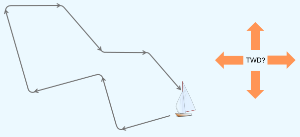
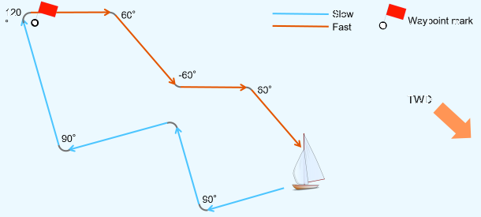
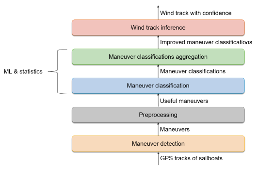

# GPS track based Wind estimation - Core concepts

This document describes concisely all the core concepts of the GPS track based wind estimation. If you are interested in details of emergence of wind estimation component, consider to read the corresponding [master thesis](../../doc/theses/Master_Thesis_-_Vladislav_Chumak_-_Wind_inference_from_GPS_tracks_of_sailboats.pdf). The master thesis provides also all the sailing theory and machine learning foundations required for understanding of wind estimation. However, be aware that with respect to the current state of development, the thesis might be outdated.

## Table of Contents

1. [Introduction](#introduction)
   1. [Basic Idea](#introductionBasicIdea)
   2. [Purpose](#introductionPurpose)
   3. [Wind estimation component](#introductionWindEstimationComponent)
2. [Main parts](#mainParts)
   1. [Overview](#mainPartsOverview)
   2. [Maneuver detection](#mainPartsManeuverDetection)
   3. [Preprocessing](#mainPartsPreprocessing)
   4. [Maneuver classification](#mainPartsManeuverClassification)
   5. [Maneuver classifications aggregation](#mainPartsManeuverClassificationsAggregation)
   6. [Wind track inference](#mainPartsWindTrackInference)
3. [Custom Hidden Markov Model](#customHmm)
   1. [Context mapping](#customHmmContextMapping)
   2. [Transition probabilities](#customHmmTransitionProbabilities)
   3. [Minimum Spanning Tree](#customHmmMst)
   4. [Inference of most probable maneuver types](#customHmmInference)
   5. [Trainable ML models](#customHmmTrainableModels)
4. [Operation in SAP Sailing Analytics](#operation)
   1. [ML models initialization](#operationModelsInitialization)
   2. [OSGI Bundles](#operationOsgiBundles)
   3. [Wind source](#operationWindSource)
   4. [Replication](#operationReplication)
   5. [ML models update via REST](#operationModelsUpdateRest)
   6. [ML models initialization via URL](#operationModelsInitializationUrl)

## Introduction 

### Basic Idea 

The basic idea behind the wind estimation comes from the ability of sailing experts to guess the true wind direction (TWD) by taking a look on the visual representation of a sailed GPS track.

Considering the GPS track depicted above, it is possible to conclude that the most probable TWD is north west. To conclude this, the following assumption can be made:
* Tacks and jibes are sailed in a symmetrical manner so that the absolute TWA before maneuver equals to the absolute TWA after maneuver
* Angle of tacks wider than of jibes and is approximately 90°

This is a very basic example. Considering further features, such as speed over ground (SOG), waypoint coordinates, boat class polars and fine-grained SOG and course over ground (COG) trends within maneuvers, the estimated TWD gets even more plausible.

The wind estimation makes use of maneuver type dependent patterns contained in maneuvers. Furthermore, boat polars, race course and meteorological characteristics of wind with its positional and temporal dependencies are considered. It incorporates various statistical and Machine Learning (ML) methods to estimate a plausible wind track by analyzing all the known patterns and information and aggregating all the partial conclusions in one piece.

### Purpose 

The SAP Sailing Analytics platform requires wind information within the sailing area in order to provide its full functional spectrum. If the wind information is not available, the platform will not be capable of estimating optimal sailing courses, showing performed maneuver types and computing important measures for performance analytics.
The main goal of the wind estimation is to prevent the limited operation of SAP Sailing Analytics by introducing estimated wind data which appears credible for sail races. The estimated wind data is meant to be used in cases, when there is no wind data provided by external measurement systems. This will be usually the case, when SAP Sailing Analytics will provide a self-service for sailors, who just want to track themselves by a simple push of a button and receive all the important information concerning their sailing performance at the end of sailing session.

### Wind estimation component 

The wind estimation is a technical component which is capable of estimating true wind direction (TWD) and true wind speed (TWS) by analyzing GPS tracks of competing sailboats within a regatta race.

Its **input** looks as follows:
* GPS-tracks of competitors of a race (mandatory)
* Waypoint coordinates (optional)
* Boat class polars (optional)

The **output** is:
* Wind track which is a sequence of wind fixes where each wind fix contains TWS, TWD, time point, position and confidence

The more input data and the better the quality of the input data gets provided to the wind estimation, the better the accuracy of estimated wind track is to expect. The component can be used in a stand-alone manner by means of the Java class ``com.sap.sailing.windestimation.SimpleConfigurableManeuverBasedWindEstimationComponentImpl``. To provide efficient integration with SAP Sailing Analytics, the assembly of internal parts of the component has been customized in order to reuse the maneuver detection of ``com.sap.sailing.domain.tracking.impl.TrackedRaceImpl`` and to support incremental computation of estimated wind track in live races. The SAP Sailing Analytics integrated wind estimation component has been implemented within ``com.sap.sailing.windestimation.integration.IncrementalMstHmmWindEstimationForTrackedRace`` class.

## Main parts 

### Overview 

The following figure depicts the main parts of the wind estimation with its data flow.

### Maneuver detection 

The first step of the wind estimation is to transform each provided GPS track into a maneuver sequence. For this, a custom algorithm has been developed and implemented in ``com.sap.sailing.domain.maneuverdetection.impl.ManeuverDetectorImpl``. The concept of maneuver detection is described in detail in [master thesis](../../doc/theses/Master_Thesis_-_Vladislav_Chumak_-_Wind_inference_from_GPS_tracks_of_sailboats.pdf) in section 4.1.

A maneuver is a section with unstable course and speed occurring due to rearrangement of sailboat to a new course. Thus, it starts already when the sailing crew is preparing to maneuvering because the preparation phase might already affect the speed. A maneuver ends when the boat reaches its new target course at target speed. For wind estimation, a maneuver instance is represented as ``com.sap.sailing.domain.tracking.CompleteManeuverCurve``. It provides various features, such as SOG and COG before maneuver, SOG and COG after maneuver, course change within maneuver (maneuver angle), lowest speed within maneuver and more.

### Preprocessing 

In the second step, maneuver instances get converted into ``com.sap.sailing.windestimation.data.ManeuverForEstimation``. Additionally, the maneuvers which do not provide any valuable information for the wind estimation get sorted out (see ``com.sap.sailing.windestimation.data.ManeuverForEstimation#isClean()``). Useful maneuvers have course changes between 30 and 120 degrees and are not affected by low quality GPS sampling. There is a comprehensive list of criteria which must be fulfilled by a maneuver instance in order to be eligible for further processing. The criteria is defined in ``com.sap.sailing.windestimation.data.transformer.ManeuverForEstimationTransformer`` and described more in detail in [master thesis](../../doc/theses/Master_Thesis_-_Vladislav_Chumak_-_Wind_inference_from_GPS_tracks_of_sailboats.pdf) in section 4.6.

### Maneuver classification 

In the third step, each maneuver instance gets classified regarding its maneuver type using Neural Networks. For classification, the following maneuver features are used as input for Neural Networks:

* Absolute maneuver angle (mandatory)
* Speed loss (mandatory)
* Speed gain (mandatory)
* Lowest speed vs. maneuver exiting speed ratio (mandatory)
* Maximal turning rate (mandatory)
* Scaled speed before (optional)
* Scaled speed after (optional)
* Mark passing (optional)
* Deviation of maneuver angle from optimal tack angle (optional)
* Deviation of maneuver angle from optimal jibe angle (optional)

See [master thesis](../../doc/theses/Master_Thesis_-_Vladislav_Chumak_-_Wind_inference_from_GPS_tracks_of_sailboats.pdf) section 4.5 for detailed information about each feature. The feature set can be adjusted in ``com.sap.sailing.windestimation.model.classifier.maneuver.ManeuverClassifierModelContext#getX()`` and ``#getNumberOfInputFeatures()``. The feature selection and evaluation of ML classification algorithms has been leveraged using Python with its scientific packages pandas, scikit-learn and matplotlib. The whole analysis is documented in thesis, as well as in Jupyter Notebook Script located in ``../../java/com.sap.sailing.windestimation.lab/python/Maneuver data analysis.ipynb``.

The output of maneuver classification step consists of maneuver instances with its classification results. Each classification result contains likelihoods for corresponding maneuver instance being of a particular type. The set of possible maneuver types is the following:
* Tack
* Jibe
* Head up
* Bear away

### Maneuver classifications aggregation 

In the fourth step, the maneuver classifications are considered all together and aggregated accordingly so that the inferred TWD sequence from maneuver classifications represents a plausible wind track with smooth TWD changes. It can be regarded as a regularization component which is meant to eliminate the impact of wrong classifications by introducing penalties for abrupt TWD changes. The TWD inference strategy is maneuver type dependent. For tack maneuvers, the TWD is the middle COG between COG before and COG after maneuver. For jibes, the TWD is determined analogously as for tacks, with additional inversion of middle COG. For instance, for a tack maneuver with COG before at 90° and COG after at 180°, the corresponding TWD will be determined as 135°.

There were 5 approaches evaluated for maneuver classifications aggregation task:
* Custom Hidden Markov Model (HMM)
* K-Means Clustering
* Mean based outlier removal
* Neighbor based ourlier removal
* Curve fitting of polars

Custom HMM approach was the most advanced and most accurate approach. In comparison to other aggregation strategies, the merit of custom HMM is its capability for adaption to continuous and smooth TWD changes and consideration of all known features/patterns from the sailing domain and meteorology. It is used in wind estimation as the default maneuver classifications aggregation strategy.

The output of maneuver classifications aggregation is a sequence of maneuvers, each with estimated maneuver type.

### Wind track inference 

In the last step, the wind track is inferred from the maneuvers with its estimated maneuver types. For this, only tack and jibe maneuvers are considered. For each tack and jibe, a wind fix is constructed as follows:
* TWD is the middle course of maneuver (inverted if jibe)
* TWS is determined by means of ``PolarDataService`` and TWA/SOG tuples before and after maneuver
* Position and time point is taken from the corresponding maneuver
* Confidence is provided from maneuver classifications aggregation strategy (Custom HMM)

## Custom Hidden Markov Model 

### Context mapping 

The contextual mapping between HMM components and wind estimation is the following:
* Subjects to observe: maneuver instances of all competitors within a single race
* Observation: features of a maneuver instance
* Hidden states: sequence of maneuver types.
* Set of possible hidden state values: Tack, Jibe, Bear away, Head up
* Initial probabilities: *P(S)=1/4* where *S* represents a maneuver type and *4* represents the number of possible maneuver types
* Transition probabilities: custom
* Emission probabilities: likelihoods for each maneuver being of specific maneuver type (classification result from Neural Networks)

For the purpose of wind estimation, the HMM concept was customized. The customization details are explained in the following sections.

### Transition probabilities 

The transition probabilities are calculated using a gaussian model which shapes the distribution of TWD shifts/deltas considering the spatial and temporal distance between two maneuvers. The gaussian model is parametrized with zero as mean, and a standard deviation/sigma which is approximated by using additional ML/regressor models. The final transition probability is sampled from the gaussian model at TWD delta, which is calculated between two maneuvers and its assumed maneuver types. The implementation of transition probabilities calculation is located in ``com.sap.sailing.windestimation.aggregator.msthmm.DistanceAndDurationAwareWindTransitionProbabilitiesCalculator``.

### Minimum Spanning Tree 

Within the custom HMM, observations/maneuvers are processed as directed acyclic graph (DAG) rather than chronologically ordered sequence. The DAG is the Minimum Spanning Tree (MST). The MST generation is implemented in an incremental manner within ``com.sap.sailing.windestimation.aggregator.msthmm.MstManeuverGraphGenerator``. The nearest neighbor of a maneuver is determined considering temporal and spatial distance from the maneuver to other maneuvers.

### Inference of most probable maneuver types 

To infer the most probable maneuver types for each maneuver, a customized version of Viterbi algorithm is used which is implemented in ``com.sap.sailing.windestimation.aggregator.msthmm.MstBestPathsCalculatorImpl``. The Viterbi algorithm is comparable to Dijstra algorithm. Its purpose is to find the path with the highest product of maneuver type likelihoods through all maneuvers. The customization of Viterbi algorithm is its compatibility with HMM customizations described in previous sections.

### Trainable ML models 

In total, there are the following three categories of ML models used by wind estimation:
1. **Maneuver Classifiers**
2. **Regressors** of TWD delta standard deviation for the dimension **duration**
3. **Regressors** of TWD delta standard deviation for the dimension **distance**

Each of the model categories are composed of multiple models where each model targets a specific context. A context for a maneuver classifier is determined by the following attributes:
* Maneuver features
   * Polar features enabled: yes/no
   * Mark features enabled: yes/no
   * Scaled speed features enabled: yes/no
* Boat class filtering for the data on which the classifier is trained, such as a specific boat class, or with all boat classes included

The context of regressor models is represented by its assigned input interval responsibility, e.g. [0 seconds; 62 seconds) for duration, or [80 meters; 1368 meters) for distance.

Each of the ML model categories must be trained individually. The common workflow looks as follows:
1. Get the training data from REST API of sapsailing.com
2. Preprocess the data
3. Train the models of the category

A complete guide for training of these internal ML models can be found here:
* [Simple Guide for training of internal Wind Estimation models](../howto/windestimation.md)
* [Advanced Guide for training of internal Wind Estimation models](../howto/windestimationAdvanced.md)

## Operation in SAP Sailing Analytics 

### ML models initialization 

Since the wind estimation relies on multiple stateful ML models, the state of the trained ML models must be provided to the wind estimation component. There are three ways to accomplish this:

* [Provide trained ML models via REST](#operationModelsUpdateRest)
* [Import the ML models from URL of another server instance](#operationModelsInitializationUrl)
* Run the server instance as replica to automatically import the ML models from master

After initialization of ML models, the ML models will be persisted in the MongoDB of the server instance. The models will be available after reboot of the server instance.

### OSGI Bundles 

The wind estimation is composed of the following three OSGI bundles:

* ``com.sap.sailing.windestimation`` - Contains all the code for production use in SAP Sailing Analytics
* ``com.sap.sailing.windestimation.lab`` - Contains all the code which is used for training of internal ML models, data visualization, evaluation of wind estimation performance and experimental code.
* ``com.sap.sailing.windestimation.test`` - Contains unit tests for wind estimation parts

The only bundle required for SAP Sailing Analytics operation with wind estimation is ``com.sap.sailing.windestimation``. When the bundle starts, an instance of ``com.sap.sailing.domain.windestimation.WindEstimationFactoryService`` gets registered in OSGI service registry. Since the bundle ``com.sap.sailing.server`` is listening to registrations of that service, it will be notified. When the ML models of the wind estimation are initialized, a new instance of ``com.sap.sailing.windestimation.integration.IncrementalMstHmmWindEstimationForTrackedRace`` will be assigned to all ``TrackedRace``-instances which automatically **causes recalculation of all maneuvers and wind caches with estimated wind**. The recalculation will be also caused on update of ML models and detaching of ``com.sap.sailing.windestimation`` bundle.

### Wind source 

Each tracked race instance will get a new wind track for estimated wind if wind estimation component gets initialized sucessfully. The wind track is managed as a wind source of type ``MANEUVER_BASED_ESTIMATION``. It is available in the wind chart of RaceBoard.

### Replication 

The wind estimation supports automatic replication of ML models. Both, initial replication and automatic replication of ML models on models update is supported.

### ML models update via REST 

ML models can be provided to wind estimation by uploading the file with [trained/serialized models](../howto/windestimation.md) via HTTP POST to http://sapsailing.com/windestimation/api/windestimation_data (see ``com.sap.sailing.windestimation.jaxrs.api.WindEstimationDataResource``). The REST interface is secured and requires the user to have ``WIND_ESTIMATION_MODELS`` permission for successful models update. Be aware that each models update via REST will cause a recalculation of maneuvers and wind caches with estimated wind for all tracked races of the server instance and its replicas.

### ML models initialization via URL 

The wind estimation bundle is capable of importing ML models via URL from another server instance. For this, provide the following VM argument to the server startup script/command: ``windestimation.source.url``. The Run Config ``SailingServer (Proxy, Jetty on 8889, Polar & Wind estimation Import from 8888)`` already includes this argument as follows: ``-Dwindestimation.source.url=http://127.0.0.1:8888``.