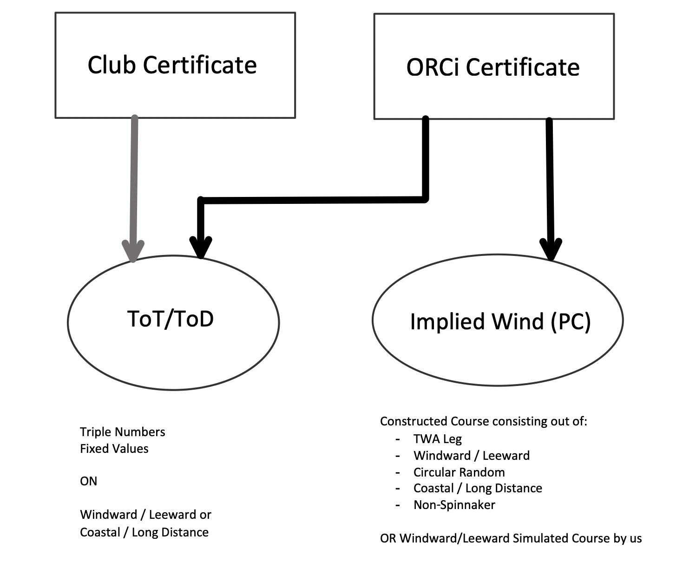

# ORC Development Roadmap
This document is for orientation of the open ToDos and possible compliactions on the development/implementation of the ORC Handicap Scoring in the SAP Sailing Analytics.

The scoring itself allows to choose between using the simpler provided ToT/ToD scoring on different values (Triple Numbers or combined values on Windward/Leeward or Coastal/Long Distance) or creating a so called performance curve for scoring. The performance curve itself can be built flexible to a predefined course (Windward/Leeward, Circular Random, Coastal/LongDistance, Non-Spinnaker), with fixed legs and their TWAs or from a combination of the first two options.

---
## Calculation Module

Currently the calculation for a constructed course with set TWAs does work with a pretty good accuracy and almost the same value as altura (differences start to occur in 1/10000 areas). The internal calculations follow the ideas provided in the ORC pascal code, many calculating parts are using the predicted velocity value instead of the allowance.
The calculation involves the following implemented parts:
- get Allowances for Leg with TWA
- get Lagrange interpolated Allowance for TWA/TWS
- get Allowances for whole Course out of leg parts
- create Performance Curve on set of Allowances
- get ImpliedWind for a given Duration on the Performance Curve
- get Duration for a given ImpliedWind on the Performance Curve

The last two stated points have currently some issues regarding the accuracy of the calculation. It is difficult to find an accurate splining method to match the values of the official ORC tools.

### Mixed Course
The next step is to extend the properties of an ORCPerformanceCurveLeg to not only be defined as a leg with a specified TWA and an fixed allowance calculated with Lagrange but also be defined as a leg as a predefined course.
- [ ] Add or change ORCPerformanceCurveLeg implementation (and interface)
- [ ] Adapt ORCPerformanceCurveImpl to handle Legs with predefined allowances
- [ ] Get Allowances from the Importer to the Certificate
- [ ] Add Test Cases for this course

---
## Adapter
After the functionality for the different course possibilities is added, there needs to be a system which takes on the difficulty between automatically deciding/proposing the course information from the tracked legs and giving the race officer the opportunity to overwrite the proposed information with his own evaluation.
This problem should be resolved by the usage of the RaceLog and by the usage of an adapter pattern to match the information given from a TrackedRace to the ORCPerformanceCurveCourse.

The next challenge will be to use the RegattaLog (and maybe also RaceLog) to define the used RankingMetric for a Race. It's not common but there are some races which mix the used RankingMetrics during a regatta. It can be Windward/Leeward with TripleNumbers on some inshore races and constructed course on a coastal.

- TrackedRace
- RaceLog
- RaceLogEvent -> non revokable

---
## Certificate Management
- MGMT, DB, PC, TripleN, ToT
- CompetitorAndBoatStore
- BoatStore
- RMS Importer
- Long Series (Mittwochsregatta, change of Certificate/Rating Number) new Certificate/Race?? 

---
## Ranking Metric
- Differences in corrected time do apply on the boat farthest ahead
- Possibility needed to select scratch boat afterwards, so comparison of corrected times with other tools under the same conditions can be provided

---
## UI Adaptions
- Leaderboard should change in regards of the ranking metric (Implied Wind automatically shown on performance curve scoring but not shown during one design races)

---